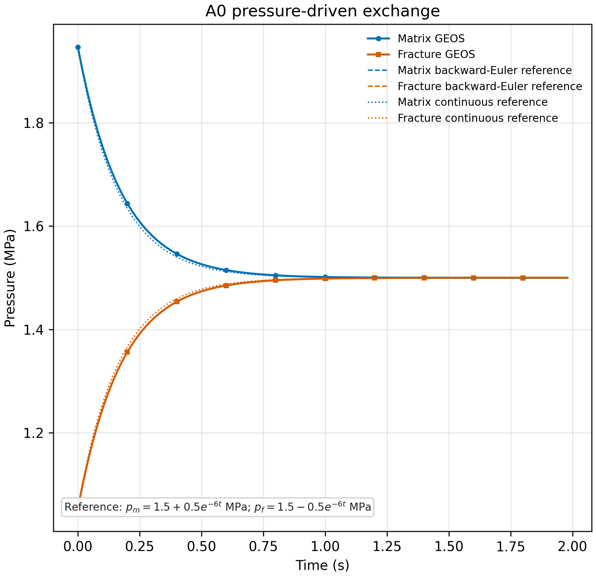

<!-- Purpose: provide a complete Chinese report for the original equal-volume A0 validation. -->

# A0 原始算例：等体积分数压差驱动交换

## 1. 算例目的

本算例只保留双重介质中的压力差驱动交叉流，用来验证最基本的基质-裂缝压力交换装配。它不包含重力、毛管压力、组分 flash 或流固耦合。

重点检查：

1. 高压侧是否向低压侧输运；
2. 基质和裂缝两侧的交换项是否等量反向；
3. 封闭体系的储集加权压力是否守恒；
4. GEOS 的后向欧拉时间推进是否符合离散参考解；
5. 压差是否按连续时间指数规律衰减。

## 2. 物理图像

基质单元初始压力为 `2.0 MPa`，裂缝单元初始压力为 `1.0 MPa`。基质压力较高，因此流体从基质流向裂缝。随着交换进行，基质压力下降、裂缝压力上升，最终两者趋向共同平衡压力 `1.5 MPa`。

两个网格在空间上完全重叠，各自几何体积为 `1 m^3`。由于使用 `fractureVolumeFraction=0.5`，双重介质 REV 中基质和裂缝分别占 `0.5 m^3` 的物理体积分数；几何网格体积不能简单相加。

## 3. 输入参数

| 参数 | 数值 |
| --- | ---: |
| 基质 REV 体积分数 `v_m` | `0.5` |
| 裂缝 REV 体积分数 `v_f` | `0.5` |
| 基质、裂缝本征孔隙度 | `0.2` |
| 流体密度 `rho` | `1000 kg/m^3` |
| 流体压缩系数 | `1.0e-12 Pa^-1` |
| 孔隙度压缩系数 | `1.0e-12 Pa^-1` |
| 渗透率 | `1.0e-12 m^2` |
| 动力黏度 | `1.0e-3 Pa s` |
| 时间步长 | `0.02 s` |
| 总时长 | `2.0 s` |

输入文件为 [`A0_pressure_exchange.xml`](A0_pressure_exchange.xml)。

## 4. 简化控制方程

令 `p_m` 和 `p_f` 分别表示基质、裂缝压力，`C_m` 和 `C_f` 表示两侧压力储集系数，`A` 表示压力交换传递系数。无外部边界时，控制方程为

$$
C_m \frac{d p_m}{d t} = -A(p_m-p_f)
$$

$$
C_f \frac{d p_f}{d t} = +A(p_m-p_f)
$$

负号和正号必须成对出现。若 `p_m > p_f`，则基质压力变化为负、裂缝压力变化为正，这正是压力从基质流向裂缝的物理方向。

## 5. 连续时间解析解

定义压力差

$$
\Delta p = p_m-p_f
$$

两式相减得到

$$
\frac{d\Delta p}{dt} = -A\left(\frac{1}{C_m}+\frac{1}{C_f}\right)\Delta p
$$

定义

$$
\lambda=A\left(\frac{1}{C_m}+\frac{1}{C_f}\right)
$$

则连续时间压差解为

$$
\Delta p(t)=\Delta p_0 e^{-\lambda t}
$$

同时，将两式相加可得

$$
C_m p_m+C_f p_f=\text{constant}
$$

因此储集加权平均压力

$$
\bar p=\frac{C_m p_m+C_f p_f}{C_m+C_f}
$$

保持不变。两侧压力为

$$
p_m(t)=\bar p+\frac{C_f}{C_m+C_f}\Delta p_0e^{-\lambda t}
$$

$$
p_f(t)=\bar p-\frac{C_m}{C_m+C_f}\Delta p_0e^{-\lambda t}
$$

原始 A0 中 `C_m=C_f=C`，其中

$$
C=\phi\rho(c_f+c_\phi)
=0.2\times1000\times(1.0\times10^{-12}+1.0\times10^{-12})
=4.0\times10^{-10}
$$

由形状因子和渗透率得到

$$
W=\frac{4V}{L_x^2}+\frac{4V}{L_y^2}+\frac{4V}{L_z^2}=1.2\times10^{-3}
$$

$$
A=kW\frac{\rho}{\mu}=1.2\times10^{-9}
$$

所以

$$
\lambda=\frac{2A}{C}=6\ \mathrm{s^{-1}}
$$

连续时间基准为

$$
p_m(t)=1.5+0.5e^{-6t}\ \mathrm{MPa}
$$

$$
p_f(t)=1.5-0.5e^{-6t}\ \mathrm{MPa}
$$

## 6. 后向欧拉基准

GEOS 使用有限时间步推进，因此还需要比较后向欧拉离散解。对第 `n+1` 个时间步，有

$$
C_m\frac{p_m^{n+1}-p_m^n}{\Delta t}=-A(p_m^{n+1}-p_f^{n+1})
$$

$$
C_f\frac{p_f^{n+1}-p_f^n}{\Delta t}=+A(p_m^{n+1}-p_f^{n+1})
$$

压差满足

$$
\Delta p^{n+1}=q_{BE}\Delta p^n
$$

其中

$$
q_{BE}=\frac{1}{1+\lambda\Delta t}
=\frac{1}{1+6\times0.02}
=0.8928571429
$$

连续时间解用于检查物理衰减规律；后向欧拉解用于检查 GEOS 的实际时间离散和交换矩阵装配。

## 7. 数值结果

运行命令使用 `build-ubuntu-lsl-release/bin/geosx`，算例正常完成：

| 检查量 | 数值 | 判据 | 结果 |
| --- | ---: | ---: | --- |
| GEOS 返回码 | `0` | 等于 `0` | 通过 |
| 时间步数 / 切步数 | `100 / 0` | 无失败切步 | 通过 |
| 数值首步衰减因子 | `0.8928571053` | 接近 `0.8928571429` | 通过 |
| 首步衰减因子相对误差 | `4.21e-8` | `<1e-5` | 通过 |
| 压差曲线最大相对误差 | `4.39e-7` | `<1e-5`，在可分辨区间内 | 通过 |
| 平均压力相对漂移 | `8.81e-8` | `<1e-6` | 通过 |
| 最后归档压差 | `11.97 Pa` | 持续衰减 | 诊断量 |

归档结果位于 `runs/20260821/`，图像位于 [`figures/`](figures/)。

## 8. 判定与限制

如果模块组装正确，应同时观察到：基质压力下降、裂缝压力上升、压差单调衰减、加权平均压力近似不变，并且 GEOS 曲线与后向欧拉基准重合。上述条件均满足，因此原始 A0 在数值可分辨区间内通过。

当压差已经接近浮点数减法分辨率时，`p_m-p_f` 的相对误差会被放大。最后的 `11.97 Pa` 不是物理上尚未平衡，而是压力差后处理的数值分辨率限制。

本算例不验证重力、毛管/渗吸、组分 flash、`PotGrad` 导数或流固耦合；这些过程由 G0、I0、J0 和 P1 分别覆盖。
