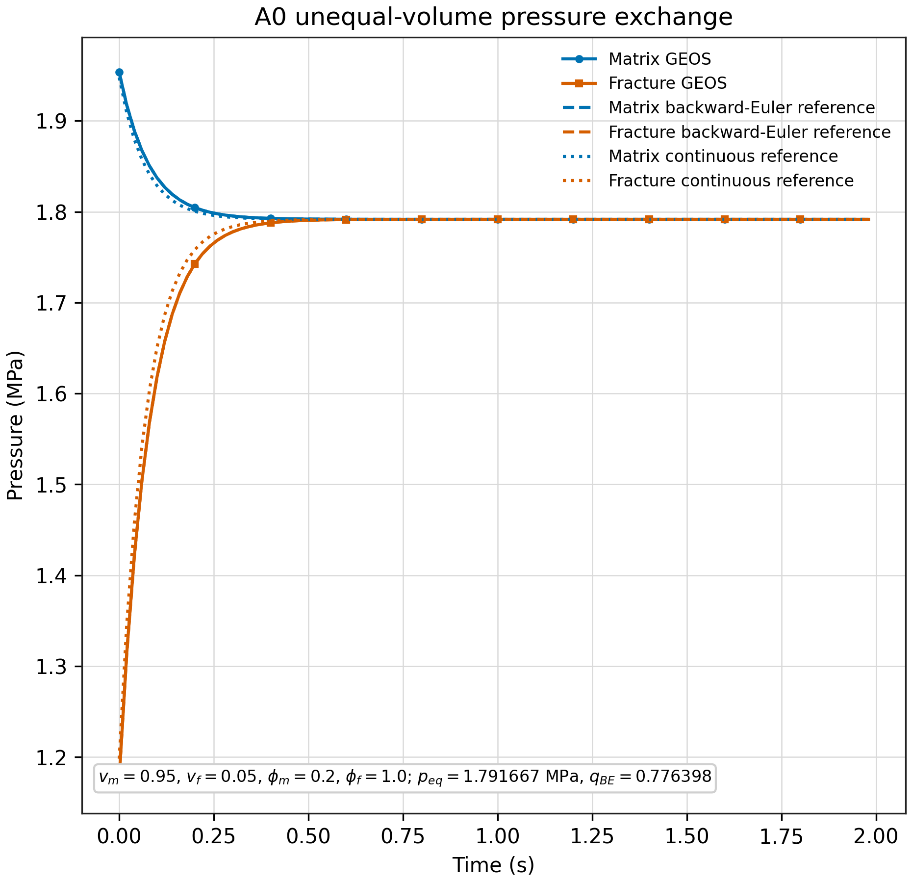

<!-- Purpose: derive and report the unequal-volume A0 pressure-exchange validation in Chinese. -->

# A0 补充算例：不等体积分数与不同本征孔隙度



## 1. 算例目的

本算例在原始 A0 的基础上改变基质和裂缝的 REV 体积分数以及本征孔隙度，用来检查双重介质储集系数是否正确使用
`fractureVolumeFraction`，并验证不等储集能力下的压力交换、加权压力守恒和最终平衡压力。

它仍然只验证压力差驱动交叉流，不引入重力、毛管压力、组分 flash 或力学耦合。

## 2. 物理图像

基质占 REV 体积的 `95%`，裂缝占 `5%`。两者几何网格仍然完全重叠，各自几何体积都是 `1 m^3`；这两个几何体积不是物理 REV 体积之和。`fractureVolumeFraction=0.05` 将它们解释为同一个 REV 内的两个连续体，其中

$$
v_m=1-v_f=0.95,\qquad v_f=0.05
$$

初始基质压力为 `2.0 MPa`，裂缝压力为 `1.0 MPa`。高压基质向低压裂缝交换流体。由于基质的有效储集能力大于裂缝，基质压力只下降较小幅度，而裂缝压力上升较大幅度；最终共同压力不是简单的算术平均，而是储集系数加权平均。

## 3. 输入参数和有效体积

| 参数 | 基质 | 裂缝 |
| --- | ---: | ---: |
| REV 体积分数 | `v_m=0.95` | `v_f=0.05` |
| 本征孔隙度 | `phi_m=0.2` | `phi_f=1.0` |
| 几何网格体积 | `1 m^3` | `1 m^3` |
| 等效 REV 体积 | `0.95 m^3` | `0.05 m^3` |
| 渗透率 | `1.0e-12 m^2` | `1.0e-12 m^2` |

输入文件为 [`A0_unequal_volume_pressure_exchange.xml`](A0_unequal_volume_pressure_exchange.xml)。裂缝本征孔隙度为 `1.0`，表示裂缝连续体内部的孔隙空间占其本征连续体体积的全部；裂缝在整个 REV 中只占 `5%`，这两个概念不能混淆。

## 4. 两储集体压力交换方程

仍令 `p_m`、`p_f` 为两侧压力，`A` 为交叉流传递系数。考虑 REV 体积分数后，两侧储集系数为

$$
C_m=v_m\phi_m\rho(c_f+c_\phi)
$$

$$
C_f=v_f\phi_f\rho(c_f+c_\phi)
$$

于是控制方程为

$$
C_m\frac{dp_m}{dt}=-A(p_m-p_f)
$$

$$
C_f\frac{dp_f}{dt}=+A(p_m-p_f)
$$

这里的 `C_m` 和 `C_f` 已经包含 REV 体积分数。因为两个网格空间重叠，不能把两个单元的几何体积直接相加；如果省略 `v_m`、`v_f`，就会错误地把两个连续体都当成完整 REV。

## 5. 守恒关系和连续时间解

令

$$
\Delta p=p_m-p_f
$$

两方程相加得到

$$
C_mp_m+C_fp_f=\text{constant}
$$

因此储集加权压力

$$
\bar p=\frac{C_mp_m+C_fp_f}{C_m+C_f}
$$

保持不变。对两方程相减得到

$$
\frac{d\Delta p}{dt}=-A\left(\frac{1}{C_m}+\frac{1}{C_f}\right)\Delta p
$$

定义

$$
\lambda=A\left(\frac{1}{C_m}+\frac{1}{C_f}\right)
$$

则

$$
\Delta p(t)=\Delta p_0e^{-\lambda t}
$$

两侧压力为

$$
p_m(t)=\bar p+\frac{C_f}{C_m+C_f}\Delta p_0e^{-\lambda t}
$$

$$
p_f(t)=\bar p-\frac{C_m}{C_m+C_f}\Delta p_0e^{-\lambda t}
$$

这说明储集量较大的连续体压力变化较小，储集量较小的连续体压力变化较大。

## 6. 参数代入

本算例使用

$$
\rho=1000\ \mathrm{kg/m^3},\qquad
c_f=c_\phi=1.0\times10^{-12}\ \mathrm{Pa^{-1}}
$$

因此

$$
c_0=\rho(c_f+c_\phi)=2.0\times10^{-9}
$$

基质和裂缝储集系数分别为

$$
C_m=0.95\times0.2\times2.0\times10^{-9}=3.8\times10^{-10}
$$

$$
C_f=0.05\times1.0\times2.0\times10^{-9}=1.0\times10^{-10}
$$

交叉流传递系数采用基质侧渗透率和体积分数缩放：

$$
A=v_m kW\frac{\rho}{\mu}
$$

其中

$$
k=1.0\times10^{-12}\ \mathrm{m^2},\quad
W=1.2\times10^{-3}\ \mathrm{m^{-2}},\quad
\frac{\rho}{\mu}=1.0\times10^6
$$

所以

$$
A=1.14\times10^{-9}
$$

压力差衰减率为

$$
\lambda=1.14\times10^{-9}\left(\frac{1}{3.8\times10^{-10}}+\frac{1}{1.0\times10^{-10}}\right)
=14.4\ \mathrm{s^{-1}}
$$

初始压力为

$$
p_{m,0}=2.0\ \mathrm{MPa},\qquad p_{f,0}=1.0\ \mathrm{MPa}
$$

因此

$$
\bar p=\frac{3.8\times10^{-10}\times2.0+1.0\times10^{-10}\times1.0}{4.8\times10^{-10}}
=1.7916666667\ \mathrm{MPa}
$$

连续时间基准为

$$
p_m(t)=1.7916666667+\frac{1.0}{4.8}e^{-14.4t}\ \mathrm{MPa}
$$

$$
p_f(t)=1.7916666667-\frac{3.8}{4.8}e^{-14.4t}\ \mathrm{MPa}
$$

其中系数中的 `1.0`、`3.8` 和 `4.8` 表示相应储集系数的相同比例单位。

## 7. 后向欧拉基准

使用 `Delta t=0.02 s`，后向欧拉离散后压差满足

$$
\Delta p^{n+1}=q_{BE}\Delta p^n
$$

其中

$$
q_{BE}=\frac{1}{1+\lambda\Delta t}
=\frac{1}{1+14.4\times0.02}
=0.7763975155
$$

所以离散基准曲线为

$$
\Delta p^n=1.0\times10^6q_{BE}^{\,n}\ \mathrm{Pa}
$$

再由加权压力守恒得到

$$
p_m^n=\bar p+\frac{C_f}{C_m+C_f}\Delta p^n
$$

$$
p_f^n=\bar p-\frac{C_m}{C_m+C_f}\Delta p^n
$$

图中的虚线是这组后向欧拉压力基准；点线是连续时间指数基准。两者的差异主要反映时间离散误差，不能把它误认为空间或物性误差。

## 8. 实际验证结果

算例运行目录为 `runs/20260822_vf095_phi1/`，运行完成 `100` 个时间步，未发生切步，GEOS 返回码为 `0`。

| 验证量 | 结果 | 判据 | 结果状态 |
| --- | ---: | ---: | --- |
| 后向欧拉参考衰减因子 `q_BE` | `0.7763975155` | 理论值 | 基准 |
| 压差曲线最大相对误差 | `5.682e-7` | `<1e-5` | 通过 |
| 加权压力相对漂移 | `5.182e-8` | `<1e-6` | 通过 |
| 最终压差 | `1.02e-5 Pa` | 接近零 | 通过 |
| 压差单调性 | 单调下降 | 全部时间点满足 | 通过 |

独立检查命令为：

```text
python3 scripts/check_A0_unequal.py \
  --run-dir runs/20260822_vf095_phi1
```

图像位于 [`figures/20260822_vf095_phi1/`](figures/20260822_vf095_phi1/)，其中同时给出了基质和裂缝的 GEOS 压力、后向欧拉参考和连续时间参考。

## 9. 模块组装正确的判据

本案例能够说明模块组装正确，需要同时满足以下现象：

1. 基质初始高压，因此基质压力下降，裂缝压力上升；
2. 压差不出现反向增长或振荡，而是单调衰减；
3. 不是使用简单算术平均压力，而是趋向 `1.7916667 MPa` 的储集加权平衡压力；
4. 基质压力变化幅度小于裂缝压力变化幅度，符合 `C_m>C_f`；
5. 两侧压力历史与后向欧拉参考曲线重合；
6. `C_m p_m+C_f p_f` 在整个计算过程中保持不变。

## 10. 结论和边界

补充 A0 通过了不等 REV 体积分数和不同本征孔隙度下的压力交换验证。它证明 `fractureVolumeFraction` 参与了双重介质储集量的计算，并且交叉流装配能够保持正确的方向和加权守恒。

该案例仍然是线性化、单相、封闭体系的局部验证，不等同于完整多相渗吸、重力驱替或流固耦合验证。后续过程应继续使用 G0、I0/J0 和 P1 等针对性案例。
