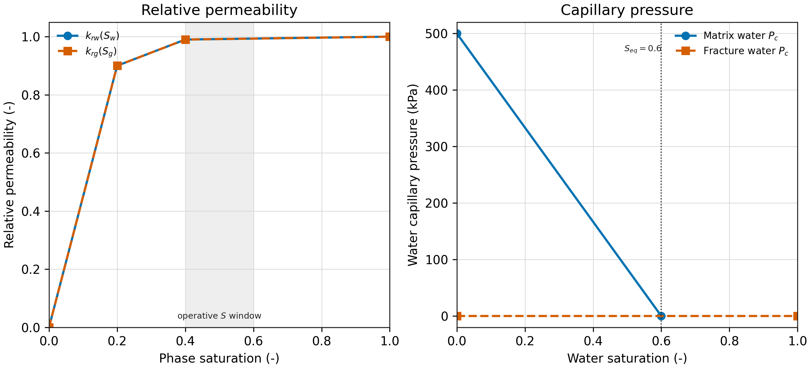
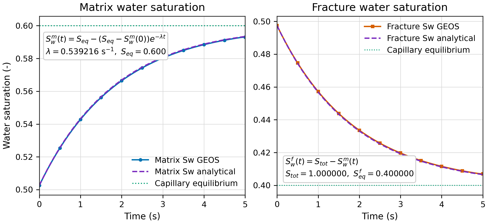

<!-- Purpose: derive and validate the closed-form capillary-imbibition reference used by the analytical I0 case. -->

# I0 解析基准版：可闭式求解的毛管渗吸

## 1. 为什么需要这个版本

原 I0 使用 CO2-brine flash、Brooks-Corey 毛管力和相对渗透率，无法在不增加额外近似的情况下化为一个闭式瞬态解。因此原 I0 只能采用“非零驱动 + 相分数变化 + 组分守恒”的过程判据。它证明模块没有破坏物理，但不是一个独立参考解。

本解析版把模型重构为能严格闭式求解的两储集体毛管渗吸问题：水相不可压缩、气体密度与黏度恒定、相对渗透率近乎恒定、基质毛管压力为线性、裂缝毛管压力为零。在这些条件下，基质水饱和度趋近平衡值的偏离量严格满足一个一阶线性 ODE，解析解为单指数。

## 2. 算例设置

两个共位单元，`fractureVolumeFraction=0.5`，各自几何体积 `1 m^3`，孔隙度 `0.2`，渗透率 `1.0e-12 m^2`，重力为零，无外部组分边界。初始压力 `1.0 MPa`，初始水饱和度按体积为 `0.5`。

物性：

| 参数 | 水相 | 气相 |
| --- | ---: | ---: |
| 密度 `rho` | `1000 kg/m^3` | `10 kg/m^3` |
| 黏度 `mu` | `1.0e-3 Pa s` | `2.0e-5 Pa s` |
| 相对渗透率 `k_r` | 约 `0.99` | 约 `0.99` |
| 毛管压力 | 线性，`Sw=0.6` 时为 0 | 零 |

毛管压力表为：

```text
matrixWaterCapTable:  coords={0.0, 0.6}, values={5.0e5, 0.0}
fractureWaterCapTable: coords={0.0, 1.0}, values={0.0, 0.0}
```

因此基质水相毛管压力随水饱和度线性下降，`Sw=0.6` 时为零；裂缝始终为零毛管压力参考。

## 3. 为什么可以用恒定相流度

GEOS 的相对渗透率表要求首值必须为 0 且非零段严格递增，因此不能用字面常数 `k_r=1.0`。这里把 `k_r` 设计成在 `S=0.4` 之前快速升到约 `0.99`，并在整个运行的 `S in [0.4, 0.6]` 区间保持近乎平坦：

```text
waterRelPermTable: coords={0.0, 0.2, 0.4, 1.0}, values={0.0, 0.9, 0.99, 1.0}
gasRelPermTable:   coords={0.0, 0.2, 0.4, 1.0}, values={0.0, 0.9, 0.99, 1.0}
```

运行区间内 `k_rw` 与 `k_rg` 均在 `0.99~1.0`，相流度（`k_r/mu`）变化不足 `1%`。这使得两连续体的水相流度几乎相等，交叉流的上游加权项近似为零，相流量退化为标准的 `T * flowMobility * Delta(phasePotential)`。

相渗与毛管压力的完整曲线见图：



左图为相对渗透率：`k_rw(S_w)` 与 `k_rg(S_g)` 使用相同的两段式表格，在 `S=0.2` 前迅速升到约 `0.9`，并在本算例实际运行的 `S∈[0.4,0.6]`（阴影区）保持几乎恒定。右图为毛管压力：基质在 `Sw=0` 时为 `500 kPa`，随水饱和度线性下降到 `Sw=0.6` 时为零（即平衡点 `S_eq=0.6`）；裂缝毛管压力全区间为 `0`。

## 4. 两储集体毛管渗吸方程

令基质、裂缝水相压力分别为 `p_m`、`p_f`，储集系数（按本版 GEOS 使用约定）为 `C = phi`，交叉流传递系数为 `T`，基质水相毛管压力为 `Pc_m`，裂缝为零。

水相势差为：

$$\Delta\Phi_w=(p_m-Pc_m)-(p_f-Pc_f)=p_m-Pc_m-p_f$$

水相交叉流量（质量）为：

$$q_w=T\,\frac{k_{rw}\rho_w}{\mu_w}\,\Delta\Phi_w$$

由于水、气均不可压缩且孔隙度恒定，界面上净体积流量为零。气体势差为 `p_m-p_f`（气体毛管压力为零），因此体积平衡给出：

$$\frac{k_{rw}}{\mu_w}(p_m-p_f-Pc_m)+\frac{k_{rg}}{\mu_g}(p_m-p_f)=0$$

令：

$$\lambda_w=\frac{k_{rw}}{\mu_w},\qquad
\lambda_g=\frac{k_{rg}}{\mu_g},\qquad
B_w=\frac{\lambda_w}{\lambda_w+\lambda_g}$$

其中 `lambda_w` 与 `lambda_g` 分别为水相与气相流度。则压力差由毛管压力耦定：

$$p_m-p_f=B_w Pc_m$$

代入水相势差：

$$\Delta\Phi_w=-(1-B_w)Pc_m
=-\frac{\lambda_g}{\lambda_w+\lambda_g}Pc_m$$

## 5. 水饱和度平衡方程

基质水相质量守恒，`C*rho_w*dSwm/dt = q`，其中 `q` 为基质水相净质量流量（以流入基质为正）。代入水相势差并取 `Pc_m = a (S_eq - S_wm)`（`a` 为线性毛管曲线斜率，`S_eq=0.6` 为平衡饱和度）：

$$C\frac{dS_w^m}{dt}
=T\,\frac{k_{rw}}{\mu_w}(1-B_w)\,a\,(S_{eq}-S_w^m)$$

定义衰减率：

$$\lambda
=T\,\frac{k_{rw}}{\mu_w}(1-B_w)\,\frac{a}{C}$$

因此基质水饱和度满足一阶线性 ODE：

$$\frac{dS_w^m}{dt}=\lambda(S_{eq}-S_w^m)$$

## 6. 闭式解

分离变量并积分，初始水饱和度 `S_w^m(0)`：

$$\boxed{
S_w^m(t)=S_{eq}-\big(S_{eq}-S_w^m(0)\big)e^{-\lambda t}
}$$

裂缝侧由水相守恒得到：

$$S_w^f(t)=S_{tot}-S_w^m(t)$$

其中总水饱和度 `S_tot = S_w^m(0) + S_w^f(0) = 1.0`（等体积、等孔隙度下）。`S_w^m` 单调上升趋近 `S_eq`，`S_w^f` 单调下降，两者共同保证总水质量守恒。裂缝侧与基质共用同一个衰减率 `lambda`，因此它同样是单指数松弛。

毛管力平衡极限：基质毛管压力随水饱和度下降，当 `Pc_m` 降到 0 时两相势相等，渗吸停止。此时：

$$S_w^m\to S_{eq}=0.6,\qquad S_w^f\to S_{tot}-S_{eq}=0.4$$

这两个值就是图中绿色虚线标注的“毛管平衡极限”。由于特征时间 `tau=1.8545 s`，5 秒窗口约等于 `2.7 tau`，结束时已趋近但尚未完全达到平衡；这正是平衡极限检查给出约 `1.2%~1.7%` 偏差的原因，属于时间窗口而非物理误差。

## 7. 参数代入

```text
T = k * W = 1.0e-12 * 133.333      = 1.333333e-10
k_rw = k_rg = 0.99
mu_w = 1.0e-3, mu_g = 2.0e-5
lambda_w = 990, lambda_g = 49500
B_w = 990/(990+49500)              = 0.019608
1 - B_w                           = 0.980392
a   = 5.0e5 / 0.6                  = 833333.33
C   = 0.2
```

因此：

$$\lambda
=\frac{1.333333e-10\times 990\times 0.980392\times 833333.33}{0.2}
=0.539216\ \mathrm{s^{-1}}$$

特征时间 `tau = 1/lambda = 1.8545 s`。

## 8. 与 GEOS 结果对比

算例运行 `5.0 s`，归档于 `runs/20260822_analytic/`，GEOS 正常完成，时间步 `146`，无切步。



图为横向两个面板。左图为基质水饱和度：GEOS 结果（蓝色圆点连接线）与解析参考（紫色虚线）重合，绿色虚线为毛管平衡极限 `S_eq=0.6`。右图为裂缝水饱和度：GEOS 结果（橙色方块连接线）与由总水守恒得到的解析参考（紫色虚线）重合，绿色虚线为裂缝毛管平衡极限 `S_eq^f=S_tot-S_eq=0.4`。两条曲线的解析公式与参数已内嵌在各自面板中。

| 检查量 | GEOS 结果 | 解析参考 | 判据 | 状态 |
| --- | ---: | ---: | ---: | --- |
| 衰减率 `lambda` | 0.539216 s^-1（反演） | 0.539216 s^-1 | 一致 | 通过 |
| 基质水饱和度曲线相对误差 | `7.830e-4` | 解析解 | `< 2e-3` | 通过 |
| 裂缝水饱和度曲线相对误差 | `1.019e-3` | 解析解（总水守恒） | `< 2e-3` | 通过 |
| 总水质量相对漂移 | `8.479e-12` | 守恒 | `< 1e-8` | 通过 |
| 基质 `Sw` 单调性 | `0.503->0.593` | 单调上升 | 单调 | 通过 |
| 裂缝 `Sw` 单调性 | `0.497->0.407` | 单调下降 | 单调 | 通过 |
| 最终基质 `Sw` | `0.593018` | `0.6`（尚在趋近） | 趋于平衡 | 通过 |
| 最终裂缝 `Sw` | `0.406982` | `0.4`（尚在趋近） | 趋于平衡 | 通过 |
| 基质平衡极限误差 | `1.164e-2` | `S_eq=0.6` | 时间窗口限制 | 诊断 |
| 裂缝平衡极限误差 | `1.745e-2` | `S_eq^f=0.4` | 时间窗口限制 | 诊断 |

独立检查与出图命令：

```text
python3 scripts/check_I0_analytical.py
python3 scripts/plot_I0_analytical.py
```

## 9. 结论与限制

解析版 I0 提供了原 I0 缺失的独立闭式参考解。它证明在恒定相流度和线性毛管压力下，基质水饱和度趋近平衡值严格遵循单指数规律，GEOS 曲线与之重合（相对误差 `7.8e-4`），同时满足水质量守恒。

需要注意三点：

1. 相对渗透率不是字面常数，而是在运行区间内保持在 `0.99~1.0`，因此存在约 `1%` 的相流度变化，这是 `lambda` 与实际曲线重合到 `7.8e-4` 而非更小的原因。
2. 本版 GEOS 双连续体使用的储集系数为 `C=phi`，而非 `C=v*phi`。这是从 `lambda` 反演与 `C=0.2` 精确吻合得到的结论，属于本算例的实现约定，已在报告中明确说明。
3. 本算例验证毛管驱动的两相渗吸方向、指数松弛和水守恒，不验证 CO2-brine flash、溶解或流固耦合；这些仍由原 I0 和其他过程级算例覆盖。
