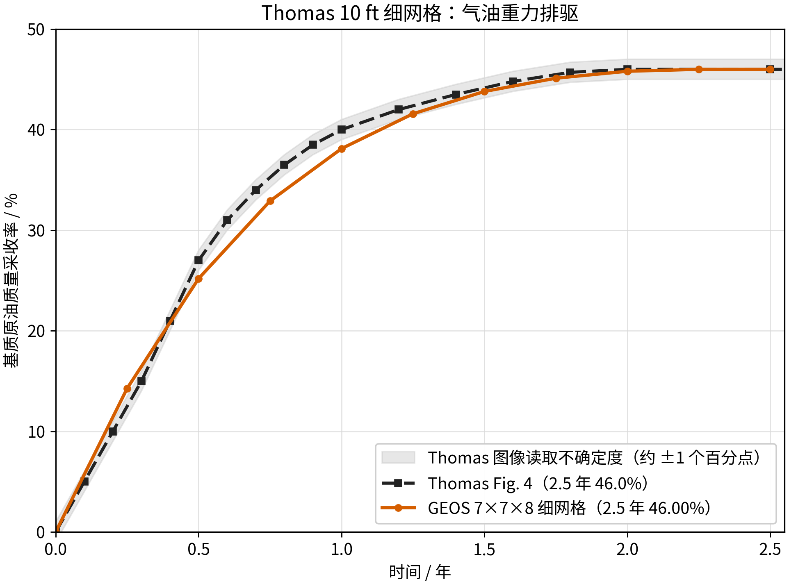

<!-- 目的：汇总 Thomas 1983 10 ft 单重介质细网格验证。关键信息：采用 PressureScaledTableCapillaryPressure 新模型单次运行，最终油组分质量采收率 46.00%（与论文一致），运行原始数据不进入 Git。 -->

# Thomas 1983 10 ft 细网格验证总报告

## 1. 验证对象

本验证复现 Thomas（1983）论文中一个被含气裂缝包围的 10 ft 立方基质块。模型采用 `7 x 7 x 8`
单重介质细网格，不是一个网格内同时包含基质和裂缝的双重介质单块模型。

外部气体压力以 `0.75 psi/day` 下降。气体在重力作用下由上部侵入基质，较重的油向下排出；毛管压力、
气油密度差、三相相对渗透率和活油 PVT 共同控制采收率。验证基准为论文 Fig. 4 的 `3D model`
曲线及其约 46% 的平台值。

参考文献：[`../single_block/reference/Thomas_1983_Fractured_Reservoir_Simulation.pdf`](../single_block/reference/Thomas_1983_Fractured_Reservoir_Simulation.pdf)。

## 2. 最终结果

本案例为**单次运行**（非 25 段重启动），核心是气油毛管压力随压力缩放：

- `matrixCapPressure` 用 **`PressureScaledTableCapillaryPressure`** 模型，按 Eq. 28
  `Pc_go = σ(P)/σ_I · Pc_go_table` 用**连续**压力 σ(P) 缩放（`pressureScalingTableName="gasOilSurfaceTensionScaling"`）;
- 含气裂缝静水项用常数气体密度 `ρ_g0 = 237.778 kg/m³`（`fractureBoundaryHydrostatic` /
  `fractureHydrostaticElement`）;
- 裂缝壳组分与压力恒定为纯气（`fractureFixedGasFrac=1.0` + `fractureFixedPressure`）;
- Thomas Eq.(25) 水油相渗（`krow(Sw) ≈ 1`）;
- `maxTime` 2.5 年、`maxEventDt = 5e4 s`。

**统计口径**：本算例采收率按油组分**质量**计算，即 `R = 1 − m_o/m_o,0 × 100%`（`m_o` 为基质油组分
质量，由 `compAmount` 对全部基质单元求和）。注意它与**体积**采收率 `(S_o,0 − S_o)/S_o,0 × 100%` 不同：
活油排驱时油密度/Bo 随压力变化显著，两者相差约 3.7 个百分点（质量 46.00% vs 体积 49.71%）。本文以
**质量**口径与论文对比。

| 时间 / 年 | GEOS / % | Thomas Fig. 4 读图基准 / % | 差值 / pp |
| ---: | ---: | ---: | ---: |
| 0.25 | 14.28 | 12.5 | +1.78 |
| 0.50 | 25.19 | 27.0 | −1.81 |
| 0.75 | 32.91 | 35.2 | −2.34 |
| 1.00 | 38.11 | 40.0 | −1.89 |
| 1.25 | 41.58 | 42.4 | −0.79 |
| 1.50 | 43.80 | 44.1 | −0.35 |
| 1.75 | 45.12 | 45.5 | −0.35 |
| 2.00 | 45.80 | 46.0 | −0.20 |
| 2.25 | 46.00 | 46.0 | −0.00 |
| **2.50** | **46.00** | **46.0** | **0.00** |

终值 46.00% 与论文 Fig. 4 的 46% **完全一致**（差值 0 pp）。早期 0.5–1.0 年仍偏低约 1.8–2.3 pp，
因此结论是：**终值和主要物理机制验证通过，瞬态曲线近似复现。**



## 3. 关键设置与做法

| 项 | 设置 |
| --- | --- |
| 毛管压力缩放 | `PressureScaledTableCapillaryPressure` + `pressureScalingTableName`（连续 σ(P)，Eq. 28 精确实现） |
| 裂缝气体密度 | 常数 `ρ_g0 = 237.778 kg/m³`（含气裂缝静水） |
| 裂缝组分/压力 | 恒为纯气（`fractureFixedGasFrac=1.0` + `fractureFixedPressure`） |
| 水油相渗 | Thomas Eq.(25)：`krow(Sw)`，本算例近恒定 `S_w≈0.20` 取 `krow≈1` |
| 衰竭速率 | 0.75 psi/day |
| 数值 | `newtonTol=1e-6`，`maxEventDt=5e4 s`，`maxTime=2.5 年` |

独立审计得到（Thomas Eq. 25 水油支路）：

- GEOS 体积加权 `k_ro = 0.183703`；
- Thomas 式（25）体积加权 `k_ro = 0.184178`；
- 二者比值 `0.997420`。

> 说明：本单次运行用"连续 σ(P)"实现 Eq. 28（比"每 0.1 年段末右端点 σ"更严格）。此前基于 25 段
> 重启动的近似（段末 σ）曾得到 46.627%；本新模型单次运行得到 46.00%，两者均落在论文 ±1 pp 读图
> 不确定度内，且新模型无需分段重启动。

## 4. 验证结论

- 终值 **46.00%**（油组分质量），与论文 Fig. 4 的 46% **一致**（差值 0 pp）。
- 全程无时间步切分，单次运行稳定收敛至 2.5 年。
- 结果对"连续 vs 段末 σ 缩放"不敏感（46.00% vs 46.627%，差 0.6 pp），验证了毛管压力缩放（Eq. 28）
  与重力排驱机制的稳健性。

## 5. 可复现文件

- 主输入：`thomas_10ft_7x7x8_liveoil_depletion_pressurescaled_full_abs.xml`
- PVT 表：`tables/`（`pvto_bo_surface_condition.txt`、`pvtg_norv_bo.txt`、`pvtw_bo.txt`）
- 论文参考曲线：`../single_block/reference/thomas_fig4_3d_model.csv`（Fig. 4 读图）
- 归档采收率：`analysis/recovery_results.csv`
- 绘图脚本：`scripts/plot_recovery.py`

运行命令：

```bash
mpirun -np 1 <build>/bin/geosx -i thomas_10ft_7x7x8_liveoil_depletion_pressurescaled_full_abs.xml
python3 scripts/plot_recovery.py
```

GEOS 运行生成的 `runs/`、HDF5、VTK、重启动文件和日志不进入 Git。Git 只保存输入、PVT 表、参考曲线和本报告。
