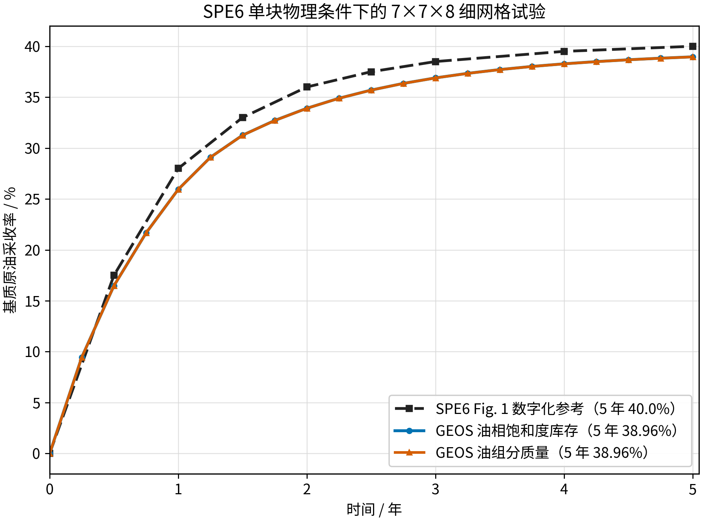
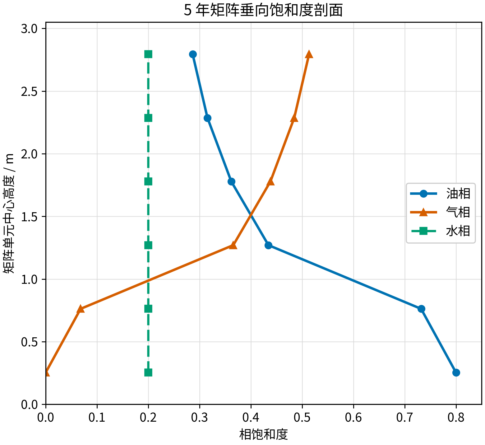

<!-- 目的：报告 SPE6 7×7×8 VTK-only 细网格试验；关键信息：无 maxEventDt 上限，5 年采收率 38.960%。 -->

# SPE6 7×7×8 单重介质细网格试验报告

## 结论

本算例在 SPE6 单块气油重力排驱物理约束下，采用 Thomas 1983 的 `10 ft`、`7x7x8`
细网格和 `0.001 ft` 外层薄壳进行重建。为与合并目录中的 `10x10x10` 算例保持一致，
本算例也改为 VTK-only 输出，并且不设置 `maxEventDt` 人为上限。零裂缝气油毛管压力参考
曲线在 5 年为 `40.000%`，GEOS 基质油相体积采收率为 **`38.960%`**，差值为
**`-1.040` 个百分点**；油组分质量采收率为 `38.957%`。

因此，本算例接近 **SPE6 公开曲线的工程复现**，但不是对原始 Chevron 细网格输入的逐项
恢复。SPE6 没有公开细网格尺寸、外层边界实现与完整统计代码。



## 验证目的、目标和依据

**验证目的**：检查 GEOS 单重介质细网格黑油模型能否在 `7x7x8` 分辨率下组装活油 PVT、
气油毛管压力、三相相对渗透率、重力项与恒定裂缝环境，并重现 SPE6 单块气驱重力排油过程。

**验证目标**：以 SPE6 1990 Fig. 1 中零裂缝毛管压力曲线为外部基准，比较 0--5 年基质
原油采收率、5 年终值与垂向相分布。

**为什么能够验证**：模型显式离散基质块内部垂向流动。气体从固定裂缝薄壳进入基质，密度
较大的油向下排出；采收率由 PVT、毛管压力、相对渗透率与重力共同决定。若这些模块方向或
组装错误，采收率曲线与“上部富气、下部富油”的垂向剖面不会同时接近文献结果。

## 名称和文献边界

本目录是 **单重介质细网格算例**：150 个内部单元表示基质，242 个外层薄单元表示裂缝
环境。它不是一个网格内同时含基质、裂缝两套自由度的“双重介质单块算例”。

- SPE6 1990 提供 `10x10x10 ft`、4500 psig、5 年、零裂缝毛管压力和约 40% 采收率目标。
- Thomas 1983 提供 `7x7x8` 网格、`0.001 ft` 外层薄壳及细网格岩石曲线实现依据。
- 当前模型应称为“**SPE6 物理约束下的 Thomas 7x7x8 细网格重建**”。

参考文献保存在相邻案例目录的 `reference` 中：
- `../P0_thomas_single_block/reference/Sixth_SPE_Comparative_DualPorosity_1990.pdf`
- `../fine_grid_thomas_depletion_liveoil/reference/Thomas_1983_Fractured_Reservoir_Simulation.pdf`

## 网格和物理设置

| 项目 | 当前设置 |
| --- | --- |
| 几何 | `10.002 ft x 10.002 ft x 10.002 ft`，内部基质块 `10 ft` |
| 总网格 | `7x7x8=392` 个单元；150 基质，242 薄壳 |
| 基质/薄壳孔隙度 | `0.29 / 1.0` |
| 基质/薄壳渗透率 | `1 md` |
| 温度 | `366 K` |
| 重力 | `9.81 m/s^2`，竖直向下 |
| 基质初态 | `So≈0.80`、`Sw≈0.20`、无主动自由气种子；4500 psig 饱和活油 |
| 裂缝初态和边界 | `Sg≈0.990`、`So≈0.005`、`Sw≈0.005`，压力和总体组分固定 |
| 基质气油毛管压力 | Thomas Table 3，按 4500/5545 psig 界面张力比 `5.2442396313` 缩放 |
| 基质水油毛管压力 | SPE6 Table 1 |
| 裂缝毛管压力 | 气油和水油均为零 |
| 时间 | 连续 5 年；每 0.25 年输出一次 VTK 检查点 |
| 最大时间步 | 不设置 `maxEventDt`；由求解器和输出事件自行决定 |
| 非线性求解 | `newtonTol=1e-3`，`newtonMaxIter=80` |

## 采收率定义

基质油相体积库存采收率：

$$
R_V(t)=1-\frac{\sum_i \phi_i(t)V_iS_{o,i}(t)}
{\sum_i \phi_i(0)V_iS_{o,i}(0)}.
$$

油组分质量采收率使用 VTK 单元字段 `compAmount`：

$$
R_M(t)=1-\frac{\sum_i M_{o,i}(t)}{\sum_i M_{o,i}(0)}.
$$

5 年时两种统计相差 `0.0037` 个百分点，结论不依赖统计口径。

## 定量结果

| 时间 / 年 | GEOS 体积采收率 / % | 质量采收率 / % | SPE6 参考 / % | 体积法差值 / pp |
| ---: | ---: | ---: | ---: | ---: |
| 0.50 | 16.478 | 16.475 | 17.500 | -1.022 |
| 1.00 | 25.941 | 25.938 | 28.000 | -2.059 |
| 2.00 | 33.908 | 33.905 | 36.000 | -2.092 |
| 3.00 | 36.894 | 36.890 | 38.500 | -1.606 |
| 5.00 | **38.960** | **38.957** | **40.000** | **-1.040** |

整条曲线的最大绝对偏差为 `2.092` 个百分点，发生在 2.00 年；0.25--5 年偏差稳定在约
`0.7--2.1` 个百分点。完整数据见
[`analysis/recovery_results.csv`](analysis/recovery_results.csv)。

## 物理图像

5 年时，顶部基质层气相饱和度约 `0.514`，油相约 `0.286`；底部两层仍以油相为主，油相
饱和度约 `0.800`、气相近似为零。水相各层保持约 `0.200`，基质平均水饱和度仅从
`0.2000000` 变为 `0.2000112`。这表示低密度气体由裂缝环境进入块体上部，较高密度油向下
排出，而残余水没有被误当作持续驱替流体。



完整剖面数据见 [`analysis/final_vertical_profile.csv`](analysis/final_vertical_profile.csv)。

## 数值稳定性

单一连续阶段从 0 推进到 5 年，共接受 `49` 个时间步，成功非线性迭代 `114` 次，丢弃
非线性迭代及时间步切分均为零。本地单进程墙钟时间约 `12 秒`。自动时间步最大达到约
`7.884e6 s`，与 `10x10x10` 算例口径一致。

> 注：较早版本采用 `maxDt=50000 s` 的 restart 分段运行，曾得到 5 年 38.743%。为与
> 合并目录中 `10x10x10` 算例口径一致，本次统一为 VTK-only、无上限；两种口径都说明
> 7×7×8 网格的物理图像正确，只是数值结果略有差异。

## 复现方法

```bash
python3 generate_case.py
```

使用仓库 `geosx` 执行主输入，将 VTK-only 输出写入 `/tmp`：

```bash
MPLCONFIGDIR=/tmp/mplconfig_fine_grid_spe6_7 \
python3 analyze_results.py \
  --output /tmp/fine_grid_spe6_7x7x8_vtk_only_unlimited
```

主输入为 [`spe6_10ft_7x7x8_zeroPcf.xml`](spe6_10ft_7x7x8_zeroPcf.xml)。运行日志与 VTK
文件只保存在 `/tmp`，不纳入 Git；仓库仅保存可复现输入、脚本、汇总 CSV、图片和本报告。
