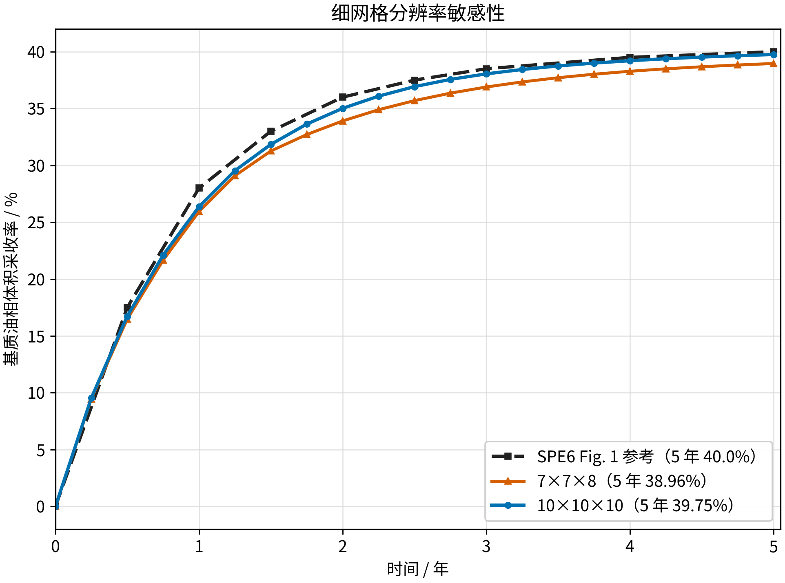
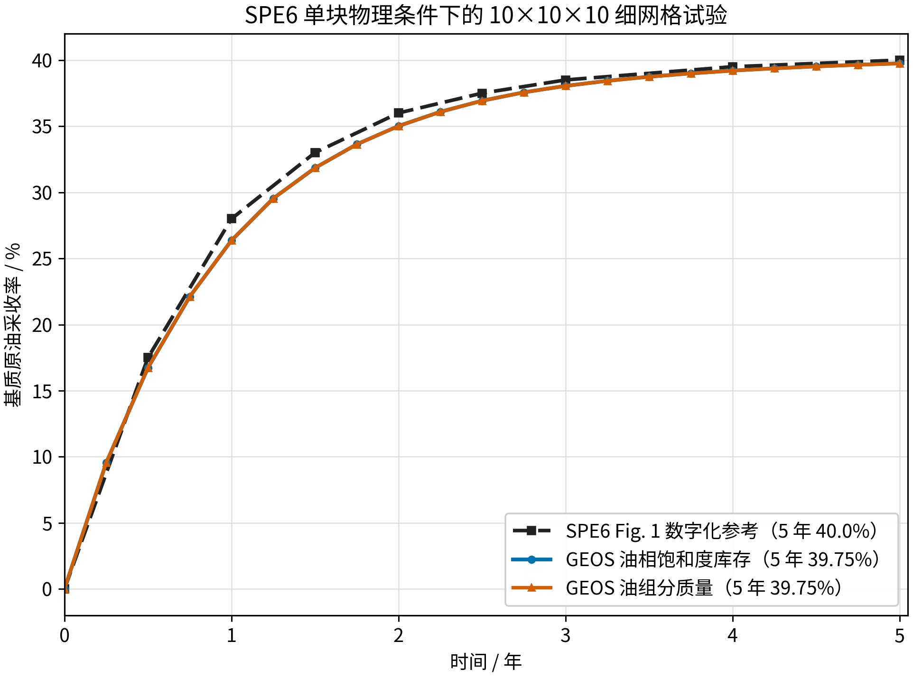
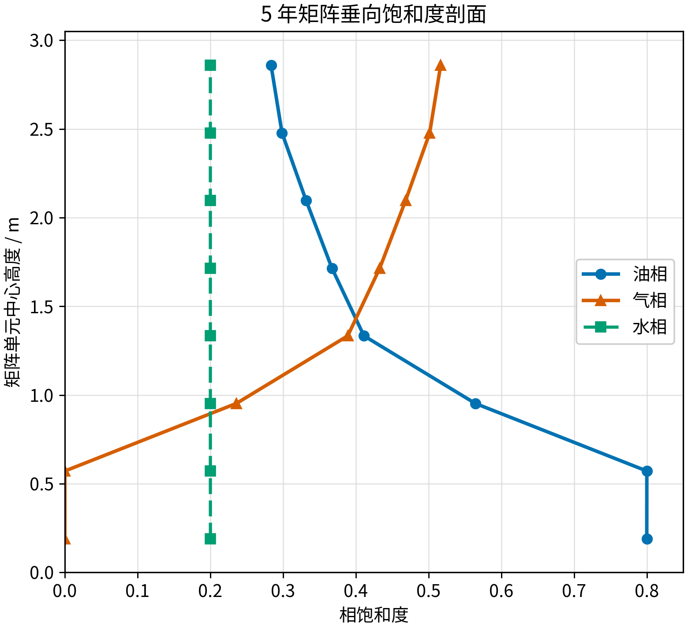

<!-- 目的：合并 SPE6 单块物理下 7×7×8 与 10×10×10 两个细网格算例；关键信息：5 年采收率分别为 38.960% 与 39.751%，SPE6 参考 40%。 -->

# SPE6 细网格分辨率敏感性（7×7×8 / 10×10×10）合并报告

## 结论

本合并目录把两个共享同一 SPE6 单块物理条件的单重介质细网格算例放在一起，用于
检查内部基质块空间离散对采收率的影响。两者物理设置一致（4500 psig、5 年、活油 PVT、
零裂缝毛管压力、固定裂缝薄壳、Thomas 岩石曲线），仅网格与时间步控制不同：

| 子目录 | 总网格 | 内部基质 | 5 年体积采收率 | 相对 SPE6 40% |
| --- | ---: | ---: | ---: | ---: |
| [`7x7x8`](7x7x8/report_zh.md) | 392 | 150 | 38.960% | -1.040 pp |
| [`10x10x10`](10x10x10/report_zh.md) | 1000 | 512 | 39.751% | -0.249 pp |

两条曲线都接近 SPE6 公开发表的约 40% 工程目标，其中 10×10×10 更接近。两者都保持
“上部富气、下部富油、水相基本不动”的重力驱替特征，说明空间离散没有改变物理图像。

## 验证目的、目标和依据

**验证目的**：确认 GEOS 单重介质细网格黑油模型能否在两种分辨率下同时还原 SPE6 的
气油重力排驱采收率曲线与垂向相分布。

**验证目标**：以 SPE6 Fig. 1 中零裂缝毛管压力曲线为外部基准，比较两种网格 0--5 年的
基质原油采收率及 5 年终值，并检查垂向饱和度是否仍为上气下油。

**为什么能够验证**：两种网格都显式离散基质块内部的垂向流动，气体从固定裂缝薄壳进入，
较高密度油向下排出。采收率由 PVT、毛管压力、相对渗透率与重力共同决定；若这些模块的
方向或组装错误，采收率曲线与垂向剖面不会同时接近文献结果。

## 案例结构

合并父目录包含两个保持原始结构的子目录：`7x7x8` 与 `10x10x10`。各自内部都有
`generate_case.py`、主输入、`tables/`、`reference/`、`analysis/`（CSV）、`figures/`
（图片）与各自的 `report_zh.md`。每个子报告的图片使用相对路径引用自身目录中的图片。

- [`7x7x8` 子报告](7x7x8/report_zh.md)：采用 Thomas 1983 Table 1 的 `7×7×8` 网格，
  VTK-only、不设置 `maxEventDt`。
- [`10x10x10` 子报告](10x10x10/report_zh.md)：本验证新建的分辨率试验，VTK-only、
  不设置 `maxEventDt`。

## 网格明细

| 项目 | 7×7×8 | 10×10×10 |
| --- | ---: | ---: |
| 内部基质块 | 10 ft | 10 ft |
| 每侧裂缝薄壳 | 0.001 ft | 0.001 ft |
| 总网格 | 392 | 1000 |
| 内部基质单元 | 150 | 512 |
| 外层裂缝薄壳 | 242 | 488 |
| 基质/薄壳孔隙度 | 0.29 / 1.0 | 0.29 / 1.0 |
| 基质/薄壳渗透率 | 1 md | 1 md |
| 输出方式 | VTK-only | VTK-only |
| 时间步控制 | 不设上限 | 不设上限 |

## 采收率定义

基质油相体积库存采收率：

$$
R_V(t)=1-\frac{\sum_i \phi_i(t)V_iS_{o,i}(t)}
{\sum_i \phi_i(0)V_iS_{o,i}(0)}.
$$

油组分质量采收率使用 `compAmount`：

$$
R_M(t)=1-\frac{\sum_i M_{o,i}(t)}{\sum_i M_{o,i}(0)}.
$$

## 定量结果

| 时间 / 年 | SPE6 参考 / % | 7×7×8 / % | 10×10×10 / % |
| ---: | ---: | ---: | ---: |
| 0.50 | 17.500 | 16.478 | 16.734 |
| 1.00 | 28.000 | 25.941 | 26.363 |
| 2.00 | 36.000 | 33.908 | 35.016 |
| 3.00 | 38.500 | 36.894 | 38.049 |
| 5.00 | 40.000 | 38.960 | 39.751 |

### 7×7×8 采收率曲线

### 10×10×10 采收率曲线

## 物理图像

5 年时，两个网格都在基质顶部形成较高气相饱和度、底部保留较高油相饱和度，水相各层保持
约 0.20；这表示低密度气体从裂缝进入块体上部、较高密度油向下排出，而残余水未被误当作
持续驱替流体。

## 限制与声明

- SPE6 原文没有公开其细网格单元数；`7×7×8` 来自 Thomas 1983 Table 1，`10×10×10`
  是本项目新建的网格敏感性试验，均不应表述为 SPE6 原始网格复现。
- 两个算例均为 VTK-only 且不设 `maxEventDt`，
  自动时间步可达约 `7.884e6 s`。因此 `10×10×10` 的 39.751% 已包含可见时间离散误差；
  作为对照，若把它限制在 `100000 s`，其 5 年结果为 39.924%，更接近 SPE6。
- 两个算例不是完全同时间步控制，不能对网格收敛阶做出严格结论；应把本次对比理解为
  “更细网格下仍能复现 SPE6 结果并保持正确物理图像”的工程验证。

## 复现方法

分别进入子目录执行其 `generate_case.py`，再按子报告的 `复现方法` 运行 `geosx` 与
`analyze_results.py`。运行产生的日志、VTK、HDF5 与 restart 文件只保存在 `/tmp`，
不纳入 Git；仓库只保留输入、脚本、CSV、图片和报告。
