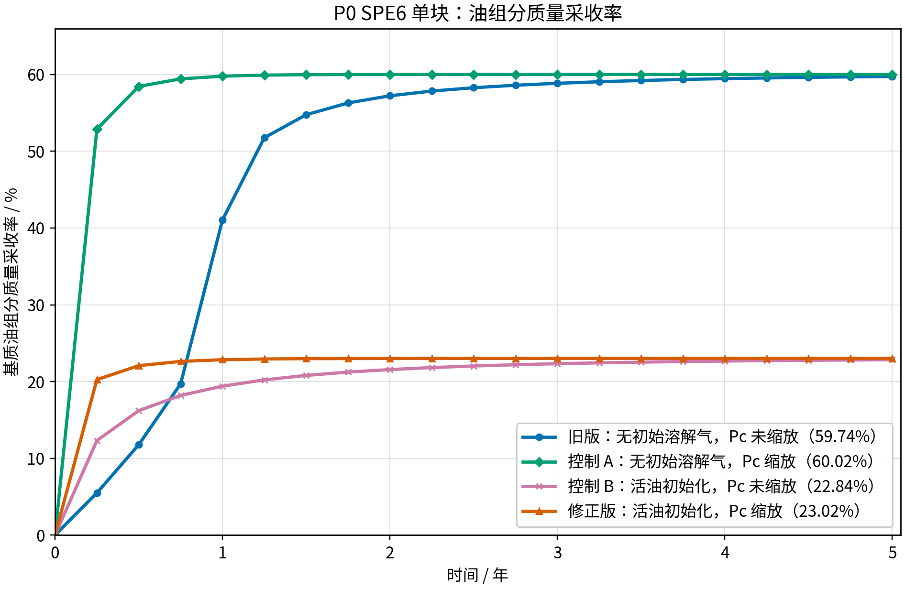

<!-- 目的：记录 SPE6 1990 单块双重介质算例的当前输入、文献对应关系和验证状态。关键信息：当前版本修正为 4500 psig 活油初始化，并采用 Thomas 气油毛管压力的 IFT 缩放。 -->

# SPE6 单块双重介质算例

## 1. 当前状态

本次已经实施了输入修正，但尚未把重跑结果标记为“验证通过”。当前算例用于检验 GEOS 的单块双重介质气油重力驱替组装是否合理；它与 SPE6 1990 文献曲线进行定量比较，但不宣称已经逐项复现某一个参赛程序的井控实现。

## 2. 物理设置

| 项目 | 当前设置 | 说明 |
| --- | --- | --- |
| 几何 | `10 ft × 10 ft × 10 ft`，约 `3.05 m` 立方体 | 一个基质单元和一个空间重叠的裂缝单元 |
| 基质本征孔隙度 | `0.29` | 基质连续体自身的孔隙度 |
| 裂缝本征孔隙度 | `1.0` | 裂缝连续体自身的孔隙度 |
| 裂缝体积分数 | `fractureVolumeFraction=0.01` | 裂缝占总体积 1%，不是额外占据一个物理立方体 |
| 基质渗透率 | `1 md` | 各向同性 |
| 裂缝渗透率 | `1000 md` | 各向同性 |
| 初始基质压力 | `4500 psig` | 当前输入的压力单位为 Pa，数值为 `3.10264065e7` |
| 初始基质组分 | `(oil, gas, water)=(0.58112639, 0.13187000, 0.28700361)` | 总和为 1；气体组分是溶解气组分，不等于初始自由气饱和度 |
| 初始基质目标相态 | `Sw≈0.20`、`So≈0.80`、`Sg≈0` | 由黑油 PVT 闪蒸决定，需由重跑输出核查 |
| 裂缝初始/外部状态 | 4500 psig、近纯气 | 作为持续外部气体状态的数值近似 |
| 裂缝气油毛管压力 | 0 | 对应 `zeroPcf`；裂缝水油毛管压力也为 0 |
| 运行时间 | 5 年 | 与 SPE6 单块研究的终止时间一致 |

## 3. 初始组分修正

旧版本使用 `(0.786, 0, 0.214)`，其中基质初始气体组分为零，表示初始油相中没有溶解气。它不是“油中已经含有溶解气但没有自由气相”的活油状态；不过，来自裂缝的气体进入后，可以先溶解到这部分油相中。

当前版本使用：

```text
oil   = 0.58112639
gas   = 0.13187000
water = 0.28700361
sum   = 1.00000000
```

这里的 `gas=0.13187000` 是守恒组分中的气体摩尔/质量混合比例（由 GEOS 的 `globalCompFraction` 输入），不是直接指定 `Sg`。只有 PVT 闪蒸后形成的自由气相体积才计入 `Sg`。因此“初始没有自由气相”必须通过输出的 `phaseVolumeFraction` 检查，不能仅凭输入的 gas 组分判断。

## 4. 气油毛管压力缩放

当前 `gasCapPresTable` 使用 Thomas 1983 Table 4 的基质气油伪毛管压力曲线。该表的参考压力为 5545 psig。根据 SPE6 原文关于 IFT 的说明，压力变更时采用：

$$
P_c(P)=P_{c,\mathrm{ref}}
\frac{\sigma(P)}{\sigma_{\mathrm{ref}}}.
$$

Thomas 表中的界面张力数据在 4110 和 4544 psig 之间线性插值得到：

```text
sigma(4500 psig) = 0.4719815668 dyn/cm
sigma(5545 psig) = 0.0900000000 dyn/cm
Pc scale         = 5.2442396313
```

因此 P0 的 8 点基质气油毛管压力曲线整体乘以 `5.2442396313`，结果记录在 [`tables/pcgo_spe6_4500psig_scaled.txt`](tables/pcgo_spe6_4500psig_scaled.txt)，并直接写入 XML 的 `gasCapPresTable`。这不是把 SPE6 1990 的“裂缝 Table 4”搬到基质中：SPE6 的裂缝毛管压力在本算例中仍然保持为零。

水油毛管压力没有按气油 IFT 比例缩放，因为当前修正针对气油界面；其水油表仍采用 P0 原有的矩阵水油数据。

## 5. 黏度处理

油黏度没有乘以 IFT 缩放因子。油黏度由 [`tables/pvto_bo.txt`](tables/pvto_bo.txt) 根据压力和溶解气状态给出。界面张力控制的是毛管压力尺度，不能把它当作油相黏度的尺度因子。

## 6. 井控与文献边界的区别

SPE6 1990 的 Single-Block Studies 只规定了 4500 psig 下的气油重力排驱、10 ft 立方基质块、一个单元的双孔隙度计算、零或 0.1 psi 裂缝毛管压力以及 5 年运行时间。原文没有把“必须设置注入井和生产井”作为单块问题的统一边界条件。

原文后面的模型说明中，Chevron 给出了自己的两单元实现：一个 `0.5 PVID` 气体注入单元和一个 `4500 psig` 生产单元。这是 Chevron 模型的实现细节，不是所有参赛程序必须采用的单块边界。

当前 P0 用“裂缝连续体保持 4500 psig 近纯气状态”近似持续外部气体状态，目的是在 GEOS 当前双重介质接口中实现可复核的供气边界。它可以用于比较物理趋势，但若要宣称完全复现 Chevron 的结果，仍需单独实现并验证其两单元井控。

## 7. 可复现文件

- 主输入：[`P0_spe_singleblock_gas_oil_zeroPcf.xml`](P0_spe_singleblock_gas_oil_zeroPcf.xml)
- 参数审计脚本：[`prepare_spe6_single_block.py`](prepare_spe6_single_block.py)
- 缩放后的矩阵气油毛管压力：[`tables/pcgo_spe6_4500psig_scaled.txt`](tables/pcgo_spe6_4500psig_scaled.txt)
- PVT 表：[`tables/pvto_bo.txt`](tables/pvto_bo.txt)、[`tables/pvtg_norv_bo.txt`](tables/pvtg_norv_bo.txt)、[`tables/pvtw_bo.txt`](tables/pvtw_bo.txt)
- SPE6 数字化参考：[`reference/spe_fig1_gas_oil_zeroPcf.csv`](reference/spe_fig1_gas_oil_zeroPcf.csv)
- 原文：[`reference/Sixth_SPE_Comparative_DualPorosity_1990.pdf`](reference/Sixth_SPE_Comparative_DualPorosity_1990.pdf)

运行结果目录、HDF5、VTK 和重启动文件不放入该验证目录的 Git 版本；它们应由主输入和脚本重新生成。

## 8. 当前修正版运行结果

使用仓库中的 `build/bin/geosx` 在本地运行 5 年，最新结果目录为 `/tmp/p0_spe6_updated_20260825_pvto`，未复制到验证目录。GEOS 推进到 `1.577e8 s`，共 819 个时间步、1 次时间步切分；运行正常结束，且没有 PVTO 自动补表警告。

| 时间 | `So` | `Sg` | `Sw` | 体积采收率 |
| ---: | ---: | ---: | ---: | ---: |
| 0 年 | 0.7999949 | 0.0000044 | 0.2000007 | 0 |
| 5 年 | 0.6157129 | 0.1842829 | 0.2000041 | 23.04% |

体积采收率按基质油相饱和度计算：

$$
R_o=\frac{S_{o,0}-S_o(t)}{S_{o,0}}.
$$

该结果证明当前输入能够形成“裂缝气向基质供气、基质油被重力驱替”的物理方向，并且初始自由气相接近零；但它与 SPE6 数字化参考的约 40% 仍有明显差距。因此当前状态是“输入修正已实施、算例可运行、定量验证未通过”，后续仍需继续核对双重介质边界和交换参数，不能把 23.04% 当作 SPE6 复现结果。

## 9. 采收率曲线与旧版启动延迟

### 9.1 采收率对比图


图中黑色虚线为 SPE6 原文图 1 的数字化参考，其纵轴原文标为 `Recovery, fraction`；其余曲线为 GEOS 单块双重介质结果，按基质油相饱和度计算：

$$
R_o(t)=\frac{S_{o,0}-S_o(t)}{S_{o,0}}\times 100\%.
$$

### 9.2 为什么旧版第一年几乎没有采收率

旧版并不是第一年没有计算，而是第一年内基质中没有形成可观测的自由气相。旧版相历史中的结果为：

| 时间 | 旧版 `Sg` | 旧版采收率 |
| ---: | ---: | ---: |
| 0 年 | 0 | 0 |
| 0.25 年 | 0 | 0 |
| 0.50 年 | 0 | 0 |
| 0.75 年 | 0 | 0 |
| 1.00 年 | 0 | 0 |
| 1.25 年 | 0.1028164 | 约 12.85% |

因此图上的旧版曲线在第一年贴着零线，1.25 年才开始明显上升。原因是旧版同时具有以下启动条件：

1. 基质初始气体组分为 `0`，因此进入基质的裂缝气体先被油相溶解；
2. 在气体仍以溶解状态存在时，基质自由气体饱和度保持 `Sg=0`，气相相对渗透率表对应 `krg=0`；
3. 只有当油相的溶解气容量接近饱和、并满足局部相平衡和毛管条件后，新增气体才形成自由气相，`Sg` 才开始增加。

因此，前一年不是“没有气体进入基质”，而是“气体进入后主要溶解在油相中”。旧版 `compAmount` 历史显示，基质气体组分量从初始约 `8.15e-10` 增加到 `1.00` 年的 `657.68`，但这一时期 `Sg` 仍为 0；到 `1.25` 年气体组分量达到 `812.79`，`Sg` 才达到 `0.1028164`。这就是旧版采收率在第一年保持不变、随后突然上升的直接原因。

### 9.3 Pc 缩放对启动时间和最终采收率的影响

控制 A 只把旧版的基质气油 Pc 乘以 `5.2442396313`，初始组分保持不变。它在 0.25 年时已经达到 `Sg=0.1188131`，而旧版在同一时刻仍为 0；5 年结果为：

这并不表示控制 A 中的气体不再溶解。控制 A 在 `0.25` 年时的基质气体组分量约为 `825.36`，旧版只有 `65.99`；前者是在更快吸收气体的同时，已经有一部分气体超过当前油相的溶解容量并形成了自由气相。GEOS 的气相压力关系为 `p_g=p_o-pc_og`，而气相毛管压力表在内部会按该约定取负号。因此在 `Sg=0` 附近，旧版输入表值为 `-5102 Pa`，控制 A 为 `-26756.7 Pa`，控制 A 的气相压力势更强，启动时间明显提前。

| 算例 | 5 年 `Sg` | 5 年采收率 |
| --- | ---: | ---: |
| 旧版：无初始溶解气，Pc 未缩放 | 0.2182458 | 27.2598% |
| 控制 A：无初始溶解气，Pc 缩放 | 0.2222224 | 27.7568% |
| 控制 B：活油组分，Pc 未缩放 | 0.1827419 | 22.8428% |
| 修正版：活油组分，Pc 缩放 | 0.1842829 | 23.0354% |

这说明“Pc 缩放提高 `Sg` 和采收率”的判断是正确的：相同初始组分下，Pc 缩放使旧版采收率提高 `0.4970` 个百分点，使活油算例提高 `0.1926` 个百分点。修正版相对于旧版仍然降低，是因为初始状态从“无初始溶解气、可先吸收外来气体的油相”改成了含溶解气的活油；这一变化造成的影响约为 `4.42` 个百分点，明显大于 Pc 缩放带来的增益。因此修正版从 `27.26%` 变成 `23.04%`，主要不是 Pc 方向错误，而是初始流体状态发生了变化。

## 10. 按油组分质量计算的采收率

### 10.1 计算定义

质量采收率使用 `compAmount` 中的油组分（component 0），不是油相体积饱和度：

$$
R_m(t)=\frac{M_{o,0}-M_o(t)}{M_{o,0}}\times 100\%.
$$

其中 `M_o` 是基质中油组分的质量。每个算例使用自己的初始油组分质量归一化。该定义与前面的饱和度采收率不同，因此不能直接把两者的数值当作同一个采收率进行比较。需要特别说明：SPE6 原文只明确写出 `oil recovery` 和 `Recovery, fraction`，没有在正文中给出质量或体积的明确计算式；因此，本文把基于 `S_o` 的曲线作为与图 1 的工程对照，并不声称已经证明原文采用了体积统计。

### 10.2 质量采收率曲线



### 10.3 结果

| 算例 | 初始油组分质量 `M_o,0` | 5 年油组分质量 `M_o(5y)` | 5 年质量采收率 |
| --- | ---: | ---: | ---: |
| 旧版：无初始溶解气，Pc 未缩放 | 5837.9422 | 2350.1953 | 59.7427% |
| 控制 A：无初始溶解气，Pc 缩放 | 5837.8016 | 2334.1490 | 60.0166% |
| 控制 B：活油初始化，Pc 未缩放 | 3228.2889 | 2490.9519 | 22.8399% |
| 修正版：活油初始化，Pc 缩放 | 3227.4693 | 2484.6355 | 23.0160% |

旧版按质量计算的采收率明显高于按油相体积计算的 `27.26%`，主要因为气体不断溶入油相，改变了油相组成、密度和体积；油组分质量的减少不再等价于油相体积的减少。质量采收率适合回答“基质油组分质量减少了多少”，饱和度采收率适合回答“基质油相体积比例减少了多少”，两者必须分开报告。由于 SPE6 原文没有给出更具体的归一化公式，若要严格确定其统计口径，还需要查阅该问题的原始输入说明、参赛程序输出定义或参考文献 3 的实现细节。

## 11. 最新进度与重力-毛管平衡结论

### 11.1 当前已完成内容

- 已完成旧版、控制 A、控制 B 和修正版四组采收率对比；同时绘制了油相饱和度采收率和油组分质量采收率两张图。
- 已确认旧版前期并非没有气体进入基质：气体组分先溶解到油相，约 1.0--1.25 年后才出现明显自由气相。
- 已确认 Pc 缩放在相同初始组分下提高气体进入速度、`Sg` 和采收率；修正版低于旧版的主要原因是初始流体由无初始溶解气油相改为活油。
- SPE6 原文只明确给出 `Recovery, fraction`，未在正文给出质量或体积归一化公式，因此当前质量曲线和饱和度曲线必须分别标注统计口径。

### 11.2 修正版最终状态的直接平衡计算

修正版 5 年油相密度为 `607.8207 kg/m^3`。使用油、气、水相密度、`Sw=0.200004`、裂缝总密度和 GEOS 的半块高度重力排驱模型，直接求解毛管压力与重力排驱压力平衡：

$$
\rho_m(S_g)=(1-S_w-S_g)\rho_o+S_g\rho_g+S_w\rho_w,
$$

$$
P_{\mathrm{GDP}}=(\rho_m-\rho_f)g\frac{L_z}{2}.
$$

若假定基质和裂缝压力相同，纯重力-毛管平衡给出：

$$
S_g\approx0.1593.
$$

实际 5 年状态还存在 `p_m-p_f=-2.288 kPa` 的压力差。将其加入完整平衡式：

$$
(p_m-p_f)-P_{c,\mathrm{internal}}+P_{\mathrm{GDP}}=0,
$$

得到：

$$
S_g=0.184283.
$$

此时 `P_GDP=5.992 kPa`，内部气相毛管压力为 `3.704 kPa`，压力差为 `-2.288 kPa`，三项相加约为零；因此当前计算的最终 `Sg` 与包含实际压力差的重力-毛管平衡一致。
