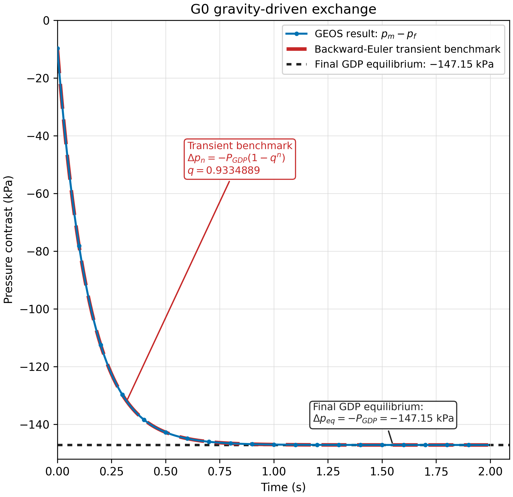
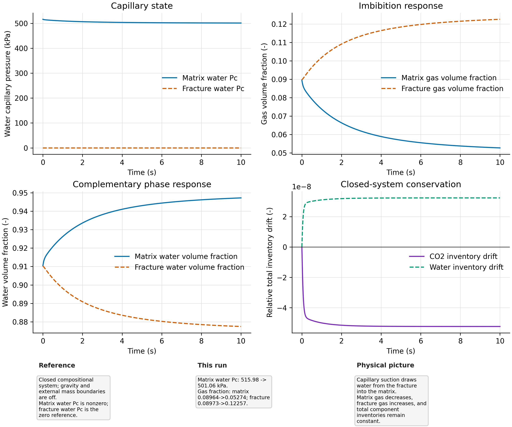
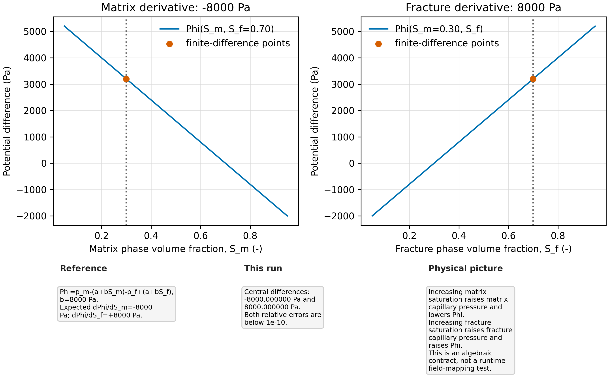
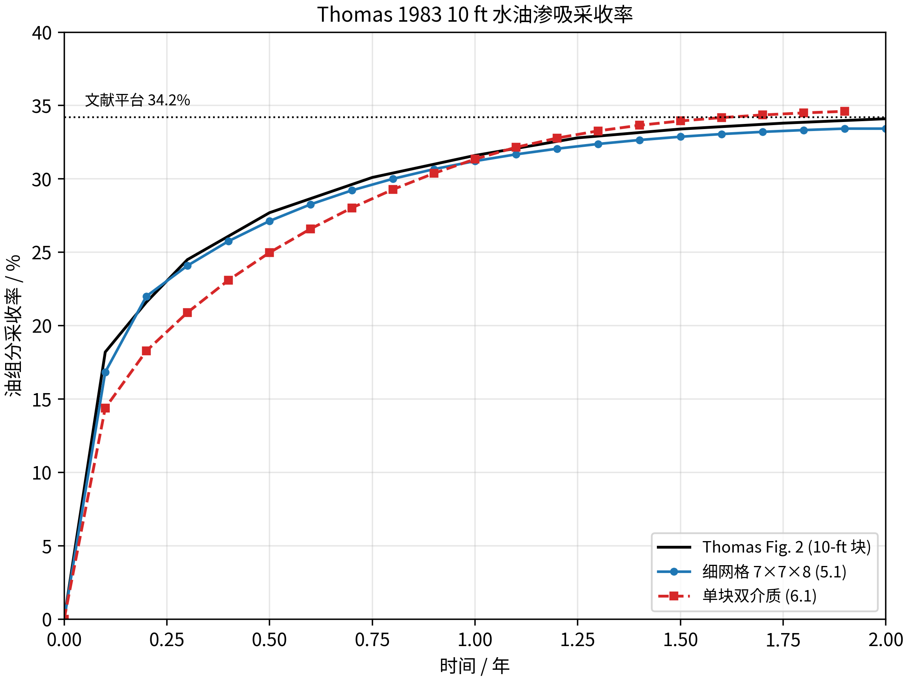
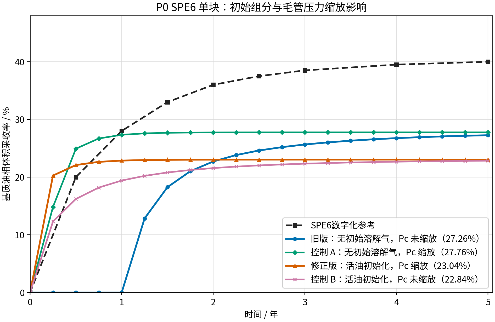

<!-- Purpose: summarize the evidence and implementation status of dual-continuum validation cases 1-8. -->

# 双重介质过程验证总报告

本目录按机制和文献案例组织双重介质基质-裂缝交换验证。case1-case4 隔离验证压力、重力、毛管和
`PotGrad` 导数；case5-case7 验证 Thomas 1983 与 SPE6 的水油/气油单块问题。当前结论是：

- **case1-case7 均已实现，并达到各自报告规定的验证或复现标准。**
- **case8 尚未实现。** 目录内仅保留探索性输入、试算结果和问题记录，当前结果不能作为 SPE6
  单块双重介质复现。

“实现”不表示所有案例采用同一种验证强度。case1-case3、case5-case7 有 GEOS 运行结果；case3.1
还有闭式解；case4 是独立有限差分代数检查，不是完整 GEOS 运行时验证。

## 状态总览

| 编号 | 目录 | 验证对象 | 主要证据 | 当前状态 |
| --- | --- | --- | --- | --- |
| 1 | `1_pressure_exchange_combined` | 等体积/不等体积压差交换 | GEOS 历史 + 两储集体解析解 | **已实现，通过** |
| 2 | `2_gravity_exchange` | 单相重力驱替压力交换 | GEOS 稳态 + GDP 解析平衡 | **已实现，通过** |
| 3 | `3_capillary_exchange` | 多相毛管渗吸动力学 | GEOS 动态历史 + 守恒与方向检查 | **已实现，通过** |
| 3.1 | `3.1_analytical` | 可闭式求解的毛管渗吸 | 严格单指数解析解 + 数值对照 | **已实现，通过** |
| 4 | `4_potgrad_derivative` | `PotGrad` 势差与 Jacobian 契约 | 独立有限差分检查 | **已实现，通过（非运行时）** |
| 5 | `5_Thomas_water_oil` | Thomas 水油渗吸，细网格与单胞 | Fig. 2 + 细网格/单胞交叉验证 | **已实现，复现成功** |
| 6 | `6_Thomas_oil_gas_depletion` | Thomas 气油枯竭，细网格与单胞 | Fig. 4 + GDP A/B + 独立 oracle | **已实现，复现成功** |
| 7 | `7_SPE6_fine_grid_gravity_drainage` | SPE6 气油重力排驱细网格 | Fig. 1 + 两种网格分辨率 | **已实现，验证成功** |
| 8 | `8_SPE6_single_block_drainage` | SPE6 双重介质单胞模型 | 当前仅有探索性试算，未达到约 40% 基准 | **尚未实现** |

## 1：压差驱动交换

case1 隔离无重力、无毛管压力的基质-裂缝压差交换。两个封闭储集体满足：

```text
Cm dpm/dt = -A (pm - pf)
Cf dpf/dt = +A (pm - pf)
```

检查内容包括流向、两侧等量反向装配、加权平均压力守恒和后向 Euler 压差衰减。等体积案例的关键结果为：

```text
GEOS exit code               0
numerical q                  0.8928571053
reference q                  0.8928571429
relative q error             4.21e-8
relative mean-pressure drift 8.81e-8
resolved-curve max error     4.39e-7
```

等体积和不等体积案例均通过。详见
[`1_pressure_exchange_combined/report_zh.md`](1_pressure_exchange_combined/report_zh.md)。


## 2：重力驱替交换

case2 在初始等压条件下隔离密度差和 GDP。参数为 `rho_m=1100 kg/m3`、`rho_f=800 kg/m3`、
`g_z=-9.81 m/s2`、`Lz=100 m`，解析目标为：

```text
GDP                           147150.0000 Pa
target p_m - p_f             -147150.0000 Pa
final p_m - p_f              -147150.0803 Pa
relative error                5.46e-7
```

相对误差小于 `1e-5` 且绝对误差小于 `1 Pa`，因此通过。该案例只验证单相 GDP，不替代 case5/case6
的 compositional 逐相 GDP 验证。详见 [`2_gravity_exchange/report.md`](2_gravity_exchange/report.md)。



## 3：毛管渗吸交换

case3 使用 CO2-brine 物性和 Brooks-Corey 毛管压力，在零重力条件下验证饱和度相关毛管交换。
GEOS 完成 `10449` 个接受时间步、零切步，毛管驱动方向、相分数响应和组分守恒检查均通过。



case3.1 进一步构造可严格闭式求解的两储集体问题。在线性毛管压力和近恒定 mobility 下，基质水
饱和度相对平衡点 `S_eq=0.6` 的偏差满足单指数衰减，数值响应与解析解一致。


详见：

- [`3_capillary_exchange/report.md`](3_capillary_exchange/report.md)
- [`3.1_analytical/report_zh.md`](3.1_analytical/report_zh.md)

## 4：PotGrad 导数契约

case4 对压力、饱和度、重力和毛管项组合后的 `PotGrad` 及 Jacobian 做独立有限差分检查。代数契约
通过，但该案例不启动完整 GEOS 求解器，因此结论限定为“实现和导数检查通过”，不能替代 case1-case3
的运行时字段映射证据。详见 [`4_potgrad_derivative/report.md`](4_potgrad_derivative/report.md)。



## 5：Thomas 水油渗吸

case5 复现 Thomas 1983 Fig. 2 中被水包围的 `10 ft` 立方基质块，同时包含单重介质细网格和
双重介质单胞模型：

| 模型 | 0.5 年采收率 | 终止点采收率 | Thomas 平台值 | 结论 |
| --- | ---: | ---: | ---: | --- |
| 细网格，Table 1 `7x7x8` | 27.134% | 33.428%（2.0 年） | 约 34.2% | 通过 |
| 双重介质单胞 | 24.981% | 34.606%（1.9 年历史点） | 约 34.2% | 通过 |

单胞模型使用 `CompositionalPerPhaseGravityDrainagePressure`、裂缝
`krw(Pc=0)=0.03` 和 Thomas 形状因子 `sigma=25/L^2`。迁移到独立逐相 GDP catalog 后，单胞完整
历史与已登记基线的最大差为 `0.000624 pp`。细网格与单胞终值分别为 `33.43%` 和 `34.61%`，均与
Thomas 平台值一致。




详见：

- [`5_Thomas_water_oil/fine_grid/report_zh.md`](5_Thomas_water_oil/fine_grid/report_zh.md)
- [`5_Thomas_water_oil/single_block/report_zh.md`](5_Thomas_water_oil/single_block/report_zh.md)

## 6：Thomas 气油枯竭

case6 复现 Thomas 1983 Fig. 4 的 `10 ft` 活油块气油重力排驱，包括细网格、双重介质单胞、GDP
开关对照和独立黑油 oracle。

### 细网格

`7x7x8` 细网格使用压力相关二维垂向平衡伪毛管压力 `Pcgo(Sg,P)`，完整运行至 2.5 年、零时间步
切分，采收率为：

| 时间 | GEOS |
| ---: | ---: |
| 0.5 年 | 25.1973% |
| 1.0 年 | 38.1167% |
| 2.0 年 | 45.8090% |
| 2.5 年 | **46.0030%** |

终值与 Thomas Fig. 4 的约 `46%` 一致。详见
[`6_Thomas_oil_gas_depletion/fine_grid/report_zh.md`](6_Thomas_oil_gas_depletion/fine_grid/report_zh.md)。


### 双重介质单胞

canonical 单胞为 `1x1x1` 基质和 `1x1x1` 裂缝，仅通过 `gravityDrainageFlag` 区分 GDP-on/off：

| 模式 | 0.5 年 | 2.5 年 | 结果 |
| --- | ---: | ---: | --- |
| GDP-off | 13.2576% | 18.7370% | 严格基线通过 |
| GDP-on | 27.3364% | 45.5423% | 严格基线通过 |
| Thomas Fig. 4 | 约 27.0% | 约 46.0% | 外部参考 |

GDP-on 全程无时间步切分；2.5 年与 Thomas 相差 `-0.4577 pp`。独立 oracle 在裂缝 `Pc=0` 时给出
`45.4514%`，与 GEOS 相差 `0.0909 pp`。


复现入口为：

```bash
python3 6_Thomas_oil_gas_depletion/single_block/scripts/reproduce.py
python3 6_Thomas_oil_gas_depletion/single_block/scripts/reproduce.py --run
```

详见：

- [`6_Thomas_oil_gas_depletion/single_block/RESULTS.md`](6_Thomas_oil_gas_depletion/single_block/RESULTS.md)
- [`6_Thomas_oil_gas_depletion/single_block/REPRODUCIBILITY.md`](6_Thomas_oil_gas_depletion/single_block/REPRODUCIBILITY.md)
- [`6_Thomas_oil_gas_depletion/single_block/report_zh.md`](6_Thomas_oil_gas_depletion/single_block/report_zh.md)

## 7：SPE6 气油重力排驱细网格

case7 在 SPE6 单块物理约束下比较两种单重介质细网格。两者均保持上部富气、下部富油和水相基本
不动的重力分异：

| 网格 | 内部基质单元 | 5 年体积采收率 | 相对 SPE6 40% |
| --- | ---: | ---: | ---: |
| `7x7x8` | 150 | 38.960% | -1.040 pp |
| `10x10x10` | 512 | 39.751% | -0.249 pp |

两种分辨率均接近 SPE6 Fig. 1 的约 `40%` 工程基准，其中 `10x10x10` 更接近。该案例证明细网格
模型已实现并能复现主要物理和终值，但不宣称使用了 SPE6 原始未公开网格。详见
[`7_SPE6_fine_grid_gravity_drainage/report_zh.md`](7_SPE6_fine_grid_gravity_drainage/report_zh.md)。


## 8：SPE6 双重介质单胞

case8 的目标是用一个基质单元和一个重叠裂缝单元实现 SPE6 约 `40%` 的 5 年气油重力排驱。目前该
目标**尚未实现**：

- 目录中已有输入、参数审计、控制变量试算和问题分析记录；这些是探索性材料，不是完成的验证案例。
- 当前修正版可以稳定运行 5 年并呈现正确供气/排油方向，但体积采收率仅约 `23.04%`。
- 该结果与 SPE6 约 `40%` 仍有明显差距，不能标记为复现成功，也不能作为 case8 最终实现。
- 后续仍需明确 SPE6 单胞统计口径、双重介质边界、交换闭合和参赛程序井控映射，再建立 canonical 输入与
  自动验收基线。

下图仅展示 case8 当前控制变量试算与 SPE6 参考的差距，属于**未通过诊断图**，不能作为验证成功证据。



详见 [`8_SPE6_single_block_drainage/report_zh.md`](8_SPE6_single_block_drainage/report_zh.md)。在上述问题
解决并完成重新验证前，case8 状态保持为“尚未实现”。

## 综合结论

1. case1-case3.1 已建立从解析解、运行历史到守恒检查的基础交换机制证据链。
2. case4 已实现 `PotGrad` 导数有限差分检查，但其验证范围仅限代数契约。
3. case5 已实现 Thomas 水油细网格和双重介质单胞，两者均复现约 34% 平台值。
4. case6 已实现 Thomas 气油细网格、GDP-on/off 单胞和独立 oracle，终值复现约 46%。
5. case7 已实现两种 SPE6 细网格分辨率，5 年采收率接近约 40%。
6. case8 尚未实现，现有 23.04% 试算只能作为诊断，不属于通过结果。
7. 因此本目录当前总体状态为：**case1-case7 已实现，case8 尚未实现。**
