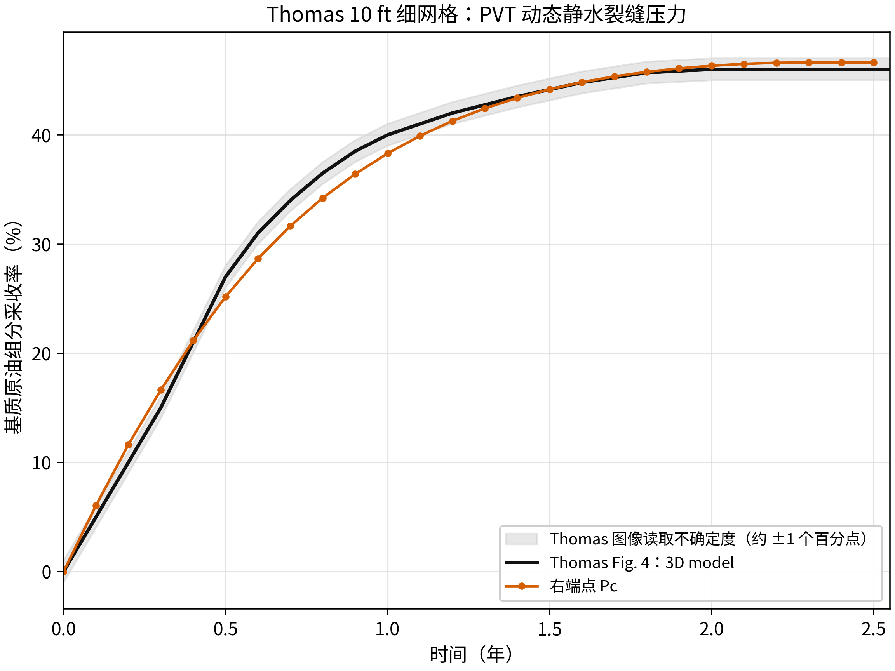
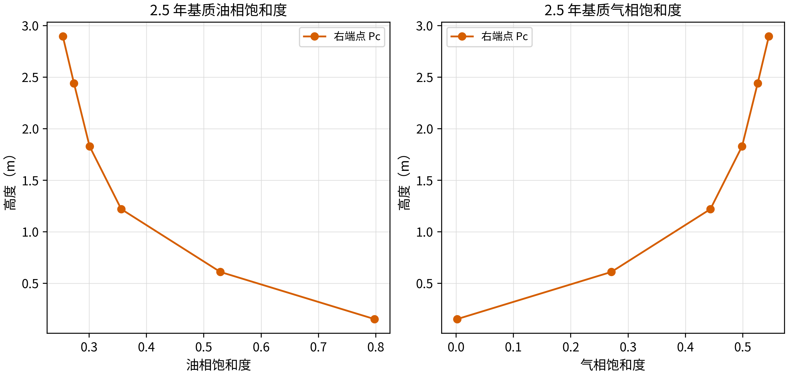
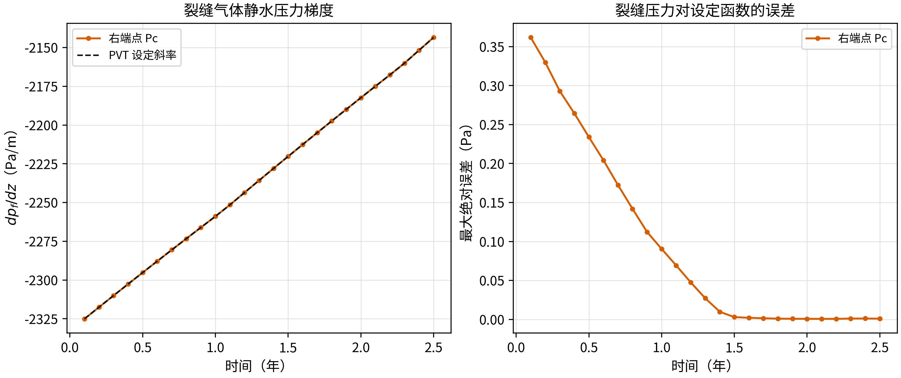

<!-- 目的：记录按 Thomas 式（25）修正相渗变量映射后的 10 ft 细网格验证。关键信息：仅修正 krow 支路，2.5 年采收率为 46.627%，与论文约 46% 基准相符。 -->

# Thomas 1983 10 ft 细网格验证报告

## 1. 验证目的

本算例复现 Thomas（1983）论文中 10 ft 单个基质块、7 × 7 × 8 细网格的气油重力排驱过程。验证目标是论文 Fig. 4 中的 `3D model` 采收率曲线，尤其是约 2.5 年时的 46% 平台值。

这是单重介质细网格验证，不是一个网格内的双重介质单块验证。它检验细网格流动、PVT、毛管压力、相对渗透率和动态静水边界是否能共同复现论文物理图像。

## 2. 物理图像

10 ft 立方基质块被气体裂缝包围。外部气体压力以 0.75 psi/day 下降，气体从块体上部侵入，油在气油密度差和重力作用下向下排出。基质水饱和度始终约为 0.20，气体饱和度从上部向下逐渐增加，最终毛管阻力与重力驱动力接近平衡，采收率进入平台。

裂缝压力采用动态气体静水形式：

$$
p_f(z,t)=p_{\mathrm{top}}(t)+\rho_g(t)g(H-z),
$$

其中 $\rho_g(t)=\rho_{g,sc}/B_g(p)$。因此重力驱动力近似为

$$
(\rho_o-\rho_g)gH.
$$

## 3. 论文公式与本次修正

Thomas 论文式（25）给出三相油相相对渗透率：

$$
k_{ro}=(k_{rw}+k_{row})(k_{rg}+k_{rog})-(k_{rw}+k_{rg}),
$$

其中：

- $k_{rw}$ 和 $k_{row}$ 来自水油两相表，查询变量是 $S_w$；
- $k_{rg}$ 和 $k_{rog}$ 来自气油两相表，查询变量是 $S_g$。

之前的 GEOS deck 将 `oilRelPermTableForOW` 预先反转后按油相饱和度查询。这在严格二相条件下可以近似工作，但在三相状态下并不等价于 Thomas 式（25），导致油相相渗被明显压低。

本算例保持所有物理输入不变，只将水油支路设置为适用于本过程的近常水饱和度形式：

```text
Sw:   0.000, 0.001, 1.000
krow: 0.000, 0.998, 1.000
```

本算例中 $S_w=0.2000\sim0.2005$，因此该表在实际油气驱替状态下等价于 Thomas Table 3 在 $S_w\approx0.20$ 附近的 $k_{row}\approx1$。气油支路仍直接使用 Thomas Table 3 的 $S_g$ 表。

## 4. 输入与基准

| 项目 | 本算例 | Thomas（1983） |
|---|---:|---:|
| 块体尺寸 | 10 ft × 10 ft × 10 ft | 10 ft × 10 ft × 10 ft |
| 网格 | 7 × 7 × 8 | 7 × 7 × 8 |
| 基质渗透率 | 1 md | 1 md |
| 基质孔隙度 | 0.30 | 0.30 |
| 初始含水饱和度 | 约 0.20 | 0.20 |
| 初始压力 | 5545 psig 状态 | Table 2：5545 psig 泡点 |
| 压力下降速率 | 0.75 psi/day | 0.75 psi/day |
| 基准曲线 | Fig. 4，3D model | 约 46% 平台值 |

## 5. 采收率验证结果



| 时间 | GEOS | Thomas Fig. 4 读图基准 | 差值 |
|---:|---:|---:|---:|
| 0.1 年 | 6.050% | 5.0% | +1.050 pp |
| 0.5 年 | 25.171% | 27.0% | -1.829 pp |
| 1.0 年 | 38.298% | 40.0% | -1.702 pp |
| 1.5 年 | 44.177% | 44.15% | +0.027 pp |
| 2.0 年 | 46.332% | 46.0% | +0.332 pp |
| 2.5 年 | 46.627% | 46.0% | +0.627 pp |

2.5 年最终采收率为 **46.627%**。相对论文约 46% 的读图值，差值为 **+0.627 个百分点**，落在约 ±1 个百分点的读图不确定度内。因此，最终采收率基准已经达到。

早期 0.5–1.0 年仍比读图曲线低约 1.7–1.8 个百分点。由于论文 Fig. 4 是低分辨率曲线、且论文没有给出逐时刻数值表，当前可以确认平台值匹配，但不能把整个瞬态曲线宣称为逐点精确匹配。

## 6. 相渗公式实现检查



最终状态呈现上部气饱和度高、油饱和度低，下部气饱和度低、油饱和度高的重力排驱图像。独立审计直接从 restart 中由质量迁移率恢复 GEOS 实际相对渗透率，并与 Thomas 式（25）按原生 $S_w/S_g$ 变量计算的结果比较：

| 量 | 结果 |
|---|---:|
| 基质单元数 | 150 |
| GEOS 体积加权 $k_{ro}$ | 0.183703 |
| Thomas 式（25）体积加权 $k_{ro}$ | 0.184178 |
| GEOS / Thomas | 0.997420 |
| 单元比值最小值 | 0.786783 |

体积加权相渗比值为 0.9974，说明本算例实际使用的 GEOS 油相相渗已经与 Thomas 式（25）一致到约 0.3%。单元最小比值出现在极低油相流动能力的顶部单元，绝对差值很小，不改变总体判断。

## 7. 裂缝静水压力检查



2.5 年时 GEOS 拟合裂缝压力梯度为约 -2143.447 Pa/m，末端设定函数误差约
$1.01\times10^{-3}$ Pa；25 个分段全链的最大绝对压力误差约为 $0.362$ Pa（出现在早期时刻）。
相对于约 $3.8\times10^7$ Pa 的绝对压力，这一误差约为 $10^{-8}$ 的相对量级。该项验证了动态 PVT
气体静水边界的组装，而不是采收率本身。

## 8. 数值敏感性排除

在独立算例中将 `newtonTol` 从 $10^{-3}$ 收紧到 $10^{-6}$，将最大事件时间步从 $2\times10^5$ s 减小到 $5\times10^4$ s，其他物理输入不变。最终采收率仅从 43.699% 变为 43.797%，最大变化 0.104 个百分点。因此，原先约 2 个百分点的主要失配不是时间步或非线性容差造成的。

## 9. 结论

本次细网格验证的关键问题已经定位并修正：此前未正确复现 Thomas 式（25）的水油支路变量映射，导致三相状态下油相相渗偏低。修正后：

- 动态 PVT 静水压力梯度通过检查；
- GEOS 实际 $k_{ro}$ 与 Thomas 式（25）体积加权结果相差约 0.3%；
- 2.5 年最终采收率为 46.627%，与论文约 46% 基准相符；
- 早期瞬态仍存在约 1.7–1.8 个百分点的读图差异，因此结论应表述为“终值和主要物理机制验证通过，瞬态曲线达到近似复现”，不能表述为逐点精确复现。

## 10. 可复现文件

- 输入生成：`generate_decks.py`
- 分段运行：`run_segments.py`
- 输入文件：`decks/right/`
- 结果表：`analysis/recovery_results.csv`
- 相渗审计：`analysis/audit_stone_relperm.py`、`analysis/stone_relperm_audit.csv`
- 静水诊断：`analysis/fracture_hydrostatic_diagnostics.csv`
- 论文基准：`reference/thomas_fig4_3d_model.csv`
