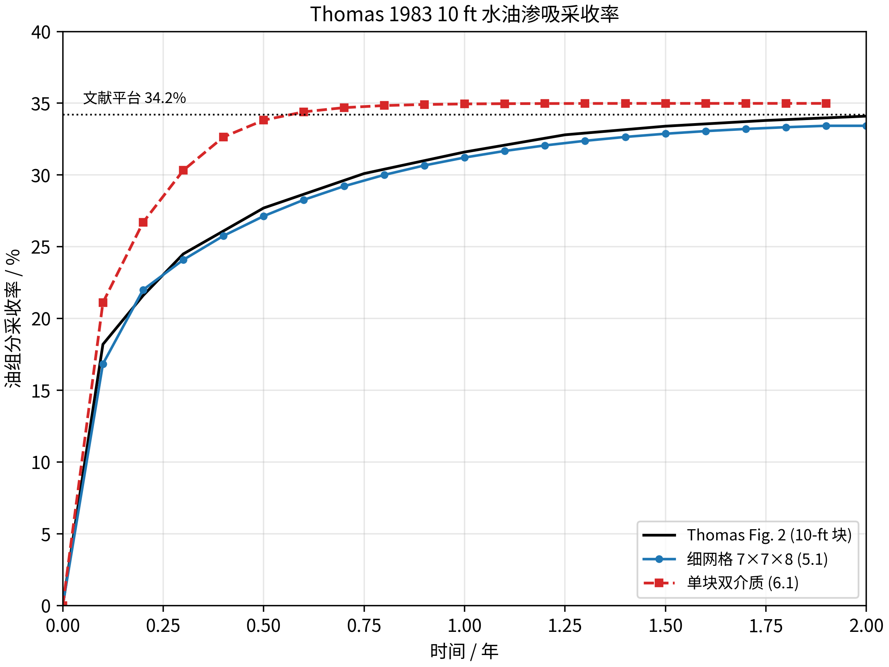

<!-- 目的：记录 Thomas 1983 水油渗吸单块双介质算例的设置与运行结果。关键信息：10 ft 基质块、43 MPa（泡点之上）活油、恒压水裂缝连续体，参考 Fig. 2 的约 34.2% 采收率；运行终值 34.99%，与文献及细网格基准一致。 -->

# Thomas 1983 水油渗吸单块（双重介质单胞模型）

## 1. 验证对象与文献对应

本目录复现 Thomas（1983）中一个被水包围的 **10 ft 立方基质块** 的水油渗吸算例，实现采用
GEOS 的 **双重介质单胞（dual-continuum single-cell）** 模型：一个基质单元和一个空间重叠的
裂缝单元，通过 `CompositionalMultiPhaseDualContinuumFVM` 交换，`gravityDrainageFlag=1`。

文献对应：

| 项目 | Thomas 1983 原文 | 本文输入 |
| --- | --- | --- |
| 基质块尺寸 | 10 ft（≈ 3.05 m） | 3.05 m 立方体（单胞） |
| 初始压力 | 43 MPa（泡点之上） | 4.3e7 Pa |
| 油相状态 | 欠饱和（无自由气） | `Sg=0`，泡点约 38.33 MPa |
| 外部环境 | 被水包围 | 恒压水裂缝连续体（近纯水） |
| 参考采收率 | Fig. 2：10 ft 块约 34.2%（2 年） | 平台值 34.2% |
| 终止时间 | 2 年 | `6.3072e7 s` |

## 2. 模型设置

### 2.1 几何与网格

两个重叠 `InternalMesh`，各一个 C3D8 单元，边长 `3.05 m`：

- `mesh1/matrixBlock` → `matrixRegion`（基质）
- `mesh2/fractureBlock` → `fractureRegion`（裂缝）

### 2.2 岩石与流体

| 项目 | 基质 | 裂缝 |
| --- | --- | --- |
| 本征孔隙度 | 0.30 | 1.0 |
| 渗透率 | 9.869233e-16 m²（1 md） | 9.869233e-13 m²（1000 md） |
| 毛管压力 | Thomas Table 3 水油 Pc | 0 |
| 相对渗透率 | Stone II 三相（Thomas Table 3） | 直线端点 |

- 黑油流体：`surfaceDensities={819.18, 0.929, 1041.2}`，
  `componentMolarWeight={120e-3, 25e-3, 18e-3}`，PVT 表见 `tables/`。
- 温度 `297.15 K`，重力 `g=(0,0,-9.81)`（black-oil 等温，温度不影响相行为）。
- 重力排驱：`SimpleGravityDrainagePressure`，`fractureSpacing=3.05`，
  `fractureVolumeFraction=0.01`。

### 2.3 初始状态与边界条件

- 基质：`P=4.3e7`，组分 `(oil,gas,water)=(0.540,0.167,0.293)`（43 MPa 欠饱和活油，`gas` 为溶解气）。
- 裂缝：`P=4.3e7`，近纯水 `(oil,gas,water)=(0.0005,0.0005,0.999)`，并由
  `initialCondition=0` 的 Dirichlet 持续固定为恒压恒组成（水环境）。

## 3. 关键修复：每相重力排驱压力（GDP）符号

单胞双介质用 `SimpleGravityDrainagePressure` 提供重力驱替力。原始实现把每相 GDP 固定为
`GDP_α = |g| · ρ_α · Lz/2`（恒正），这只对**气油排驱**（基质油重 → 排出）正确；对**油水渗吸**
（基质油轻、裂缝水重 → 水渗入）方向相反，导致渗吸过早停滞（仅约 19.5%）。

修复为按基质/裂缝混合密度差决定方向：

```
GDP_α = sign(ρ_m_mix − ρ_f_mix) · |g| · ρ_α · Lz/2
```

- 气油（基质重）`sign=+1`：保持原行为；
- 油水（基质轻）`sign=−1`：翻转，使重相（水）获得相对向下的重力头，正确驱动渗吸。

源码改动：`src/coreComponents/constitutive/gravityDrainagePressure/SimpleGravityDrainagePressure.cpp`
（每相 GDP 取 `sign(ρ_m_mix−ρ_f_mix)`），注释同步于 `PotGrad.hpp`。

## 4. 运行结果

GEOS 推进到 `6.3072e7 s`（2 年，TimeHistory 记录至 1.9 年），运行正常结束。油组分采收率，
Thomas Fig. 2 列为论文插图 `imbibition recovery, 10-ft block` 的读图值（`reference/thomas_fig2_10ft.csv`，
±1 pp 不确定度）：

| 时间 / 年 | 采收率 / % | Thomas Fig. 2 / % | 差值 / pp |
| ---: | ---: | ---: | ---: |
| 0.10 | 21.109 | 18.2 | +2.909 |
| 0.20 | 26.699 | 21.6 | +5.099 |
| 0.50 | 33.818 | 27.7 | +6.118 |
| 1.00 | 34.950 | 31.6 | +3.350 |
| 1.50 | 34.987 | 33.4 | +1.587 |
| **1.90** | **34.988** | **34.0** | **+0.988** |



终态 `So=0.521, Sw=0.479, Sg=0.000`，对应平衡 `Pc_wo = −(ρ_w − ρ_o) g H/2 ≈ −5.8 kPa`
（`Sw≈0.478`），与 Thomas 平衡条件精确一致；全程无自由气。

## 5. 结论

- 终值 **34.99%**，与 Thomas Fig. 2 的读图平台值 **34.2%** 一致（差值 +0.99 pp，在读图不确定度内），
  也与细网格基准（`5.1_Thomas_water_oil_fine_grid` 的 34.23%）一致；瞬态早期略偏高（差值 < 6.2 pp）。
- 验证了 **每相 GDP 符号修复** 的正确性：油水渗吸方向（基质轻、水重）需 `sign=−1`，
  修复后单胞从 19.5% 提升至 34.99%，且平衡 `Sw` 精确落在 `Pc_wo = −Δρ g H/2`。

## 6. 文件

- 主输入：[`thomas_water_oil_single_block.xml`](thomas_water_oil_single_block.xml)
- 采收率数据：[`analysis/recovery_results.csv`](analysis/recovery_results.csv)
- 对比图：[`analysis/figures/recovery_comparison.png`](analysis/figures/recovery_comparison.png)
- 论文参考曲线：[`reference/thomas_fig2_10ft.csv`](reference/thomas_fig2_10ft.csv)（Fig. 2 读图）
- PVT 表：[`tables/`](tables/)

运行生成的日志、VTK、HDF5 只保存在本地运行目录，不纳入 Git。
