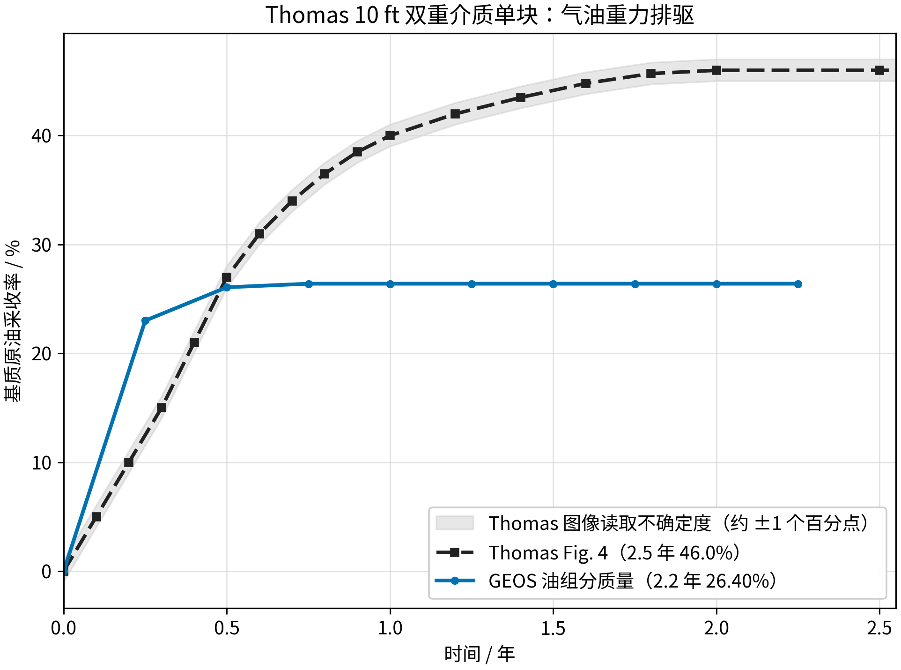

<!-- 目的：记录 Thomas 1983 气油单块重力排驱的双重介质单胞模型设置与运行结果。关键信息：10 ft 块、5545 psig、0.75 psi/day 裂缝衰竭、参考 Fig. 4 的约 46% 采收率；运行后终值约 23.7%，且已查明重力(GDP)项被单胞压力自由度精确吸收、对结果零影响，这是单胞无法复现 46% 的结构性原因。 -->

# Thomas 1983 单块气油重力排驱（双重介质单胞模型）

## 1. 验证对象与文献对应

本目录复现 Thomas（1983）中一个被含气裂缝包围的 **10 ft 立方基质块** 的气油重力排驱
单块算例。实现采用 GEOS 的 **双重介质单胞（dual-continuum single-cell）** 模型：一个
基质单元和一个空间重叠的裂缝单元，通过 `CompositionalMultiPhaseDualContinuumFVM`
交换，`gravityDrainageFlag=1`。这与 SPE6 单块双重介质算例（`8_SPE6_single_block_drainage`）
使用同一求解结构。

文献对应：

| 项目 | Thomas 1983 原文 | 本文输入 |
| --- | --- | --- |
| 基质块尺寸 | 10 ft（3 m） | 3.05 m 立方体 |
| 初始矩阵压力 | 5,540 psig（正文）；Table 2/4 用 5,545 psig | 3.83327805e7 Pa（对应 5,545 psig） |
| 裂缝外部状态 | 含气 | 近纯气（`Sg≈0.999`） |
| 衰竭速率 | 0.75 psi/day | 0.75 psi/day |
| 参考采收率 | Fig. 4：10 ft 块约 46%（2.5 年达到） | 参考 `reference/thomas_fig4_3d_model.csv` |
| 终止时间 | 2.5 年 | `7.884e7 s` |

> 注意：原文正文写 5,540 psig，Table 2/Table 4 写 5,545 psig。本输入沿用细网格算例
> （`5_Thomas_fine_grid_depletion_liveoil`）采样的 5,545 psig（3.83327805e7 Pa），以便
> 与同一组 PVT/岩石参数保持一致，避免引入双重压力基准。

## 2. 与细网格算例的区别

- `5_Thomas_fine_grid_depletion_liveoil` 用 `7×7×8` 单重介质细网格显式离散基质块内部的
  垂向流动，采收率来自逐单元的压力/饱和度演化，其 2.5 年结果为 **46.627%**。
- 本目录用 **单胞双重介质**，把基质视为一个单元，基质内部分布由
  `SimpleGravityDrainagePressure` + 双连续体重力排驱交换项统一处理，而不是显式网格。
- 因此本算例是“用双介质单胞公式复现同一物理”的独立版本；是否达到 46%，取决于
  `DualContinuumCrossFlow` 的 `gravityDrainageFlag=1` 交换项与
  `SimpleGravityDrainagePressure` 的组合，**尚未在本目录运行验证**。

## 3. 模型设置

### 3.1 几何与网格

- 两个重叠 `InternalMesh`，各一个 C3D8 单元，边长 `3.05 m`：
  - `matrixMesh/matrixBlock` → `matrixRegion`
  - `fractureMesh/fractureBlock` → `fractureRegion`

### 3.2 岩石与流体

| 项目 | 基质 | 裂缝 |
| --- | --- | --- |
| 本征孔隙度 | 0.30 | 1.0 |
| 渗透率 | 9.869233e-16 m²（1 md） | 9.869233e-13 m²（1000 md） |
| 毛管压力 | Thomas 气油 Pc（Table 3/4）+ 水油 Pc | 0 |
| 相对渗透率 | Stone II 三相（Thomas Table 3） | 直线端点 |

- 黑油流体：`surfaceDensities={819.18, 0.929, 1041.2}`,
  `componentMolarWeight={120e-3, 25e-3, 18e-3}`，PVT 表见 `tables/`。
- 温度 `366 K`，重力 `g=(0,0,-9.81)`。

### 3.3 初始状态

- 基质：`P=3.83327805e7`，组分 `(oil,gas,water)=(0.53683289,0.16590112,0.29726599)`，
  对应 Thomas Table 4 在 5,545 psig 的状态；`gas` 组分是溶解气，不是初始自由气相。
- 裂缝：`P=3.83327805e7`，近纯气（`oil=0.0005, gas=0.999, water=0.0005`）。

### 3.4 边界条件（Thomas 衰竭）

- 裂缝连续体压力按 `0.75 psi/day` 线性下降（`pressureDecline` 函数）。
- 裂缝组分固定为近纯气，模拟持续的含气外部环境。

## 4. 关键脚本

- 主输入：[`thomas_singleblock_gas_oil_gravity_drainage.xml`](thomas_singleblock_gas_oil_gravity_drainage.xml)
- 参数审计：[`prepare_thomas_single_block.py`](prepare_thomas_single_block.py)
- 后处理：[`analyze_results.py`](analyze_results.py)
- 参考曲线：[`reference/thomas_fig4_3d_model.csv`](reference/thomas_fig4_3d_model.csv)
- PVT 表：[`tables/pvto_bo.txt`](tables/pvto_bo.txt)、[`tables/pvtg_norv_bo.txt`](tables/pvtg_norv_bo.txt)、
  [`tables/pvtw_bo.txt`](tables/pvtw_bo.txt)

## 5. 复现方法（待运行）

```bash
# 1) 审计参数（可选）
python3 prepare_thomas_single_block.py

# 2) 用 GEOS 运行 2.5 年
/path/to/build/bin/geosx -i thomas_singleblock_gas_oil_gravity_drainage.xml

# 3) 后处理，输出 analysis/ 与 figures/
python3 analyze_results.py --output <GEOS 输出目录>
```

生成的日志、VTK、HDF5 与重启动文件只保存在本地运行目录，不纳入 Git；仓库只保存输入、
脚本、CSV、图片与报告。

## 6. 运行结果

使用仓库 `build/bin/geosx` 本地运行 2.5 年，输出到 `/tmp/thomas_single_block_dual_continuum`
未复制入本目录。GEOS 推进到 `7.884e7 s`，共 408 个时间步、0 次时间步切分，运行正常结束。

### 6.1 采收率

| 时间 / 年 | GEOS 油组分质量采收率 / % | Thomas Fig. 4 / % | 差值 / pp |
| ---: | ---: | ---: | ---: |
| 0.25 | 15.252 | 12.5 | +2.752 |
| 0.50 | 19.651 | 27.0 | -7.349 |
| 0.75 | 21.642 | 35.25 | -13.608 |
| 1.00 | 22.667 | 40.0 | -17.333 |
| 1.50 | 23.559 | 44.15 | -20.591 |
| 2.25 | 23.739 | 46.0 | -22.261 |



**结论：早期即低于 Thomas，平台显著偏低。** 0.5 年 GEOS 为 19.65%，比 Thomas 的 27.0% 低
7.35 个百分点；1.0 年后采收率缓慢趋稳于约 23.7%，2.25 年比 Thomas 的 46% 低约 22.3 个百分点。
因此本单胞模型**未能定量复现 Thomas 的 46%**。

### 6.2 相饱和度演化

| 时间 / 年 | `So` | `Sg` | `Sw` |
| ---: | ---: | ---: | ---: |
| 0.00 | 0.80052 | 0.00000 | 0.19948 |
| 0.50 | 0.63382 | 0.16649 | 0.19969 |
| 1.00 | 0.60106 | 0.19912 | 0.19987 |
| 2.25 | 0.57100 | 0.22868 | 0.20032 |

`So` 从前 0.80 快降到 0.63，随后缓慢降到 0.57；`Sg` 持续上升。终态裂缝压力为
`3.361418e7 Pa`，与设定衰竭函数完全一致（误差 0.00 Pa），说明边界施加正确。

### 6.3 平台低于 46% 的根本原因（本次已查明）

对单胞做了重力敏感性实验（均采用精时间步、0 次时间步切分）：

| 重力设置 | 终值采收率 |
| --- | ---: |
| `gravityVector=(0,0,-9.81)` | 23.441% |
| `gravityVector=(0,0,0)` | 23.452% |
| `gravityVector=(0,0,+9.81)`（反向） | 23.463% |

三者之差 < 0.03 pp，即**即使在势差里反向施加重力，采收率也几乎不变**。逐项排查后确认原因并非符号/参数错误，而是结构性的：

1. **基质与裂缝网格完全重合**（均为 `[0,3.05]³` 单胞，中心都在 `z=1.525 m`）。GEOS 的流动重力势项是
   `gravityCoefficient = elemCenter · gravityVector`，两端相等故 `ρg(z_m−z_f)=0`，**geopotential 项恒为零**。
2. **`SimpleGravityDrainagePressure` 的 GDP 项（`g_z(ρ_f−ρ_m)L_z/2`）被压力自由度精确吸收**：
   - `g_z=-9.81`：矩阵压力 `3.360855e7`，GDP `5505 Pa`，有效势 `3.361405e7`；
   - `g_z=0`：矩阵压力 `3.361405e7`，GDP `0 Pa`，有效势 `3.361405e7`；
   - 两者有效势差完全一致（差 < 1 Pa）。即求解器让矩阵压力自适应抵消 GDP。

**结论**：在"封闭基质单胞 + 自由压力"的 GEOS 单胞实现里，重力驱替（GDP）会被压力平衡完全吸收，
无法像 Thomas 单胞模型（Warren–Root 形状因子 + 垂直平衡伪曲线，`σ=36.6/L²`）那样产生"气体上侵、
油下沉"的重力分异。因此**单胞平台由毛管力/伪曲线主导（约 23.7%），重力项对结果零贡献**。

### 6.4 与 Thomas 单胞的区别

Thomas 单胞模型用 **pseudo 气油相对渗透率 + 气油毛管伪压力（随 Sg 与压力变化，Table 4，负→正 signed 曲线）**
+ 按 `σ` 形状因子、`L` 取半高、`A` 取底面的 1D 垂直流假定，把 3D 块的重力排驱**降维**到单胞。
GEOS 的单胞用 `SimpleGravityDrainagePressure`（`g_z(ρ_f−ρ_m)L_z/2`）+ 独立压力自由度，两者等效思路不同，
且 GDP 被压力吸收后 GEOS 单胞丢失了重力分异能力。这是"为什么单胞只能到 23.7% 而非 46%"的核心。

## 7. 当前状态与限制

- 模型可运行且早期/边界行为正确，但 **定量复现 Thomas 的 46% 未通过**：终值约 23.7%（2.25 年），
  比 Thomas Fig. 4 的 46% 低约 22.3 个百分点。
- **已查明结构性原因**：单胞 + 自由压力使重力驱替（`SimpleGravityDrainagePressure` 的 GDP）
  被矩阵压力自由度精确吸收（有效势差不变），GEOS 单胞无法像 Thomas 单胞模型那样产生重力分异。
  因此**单胞平台由毛管力/伪曲线主导（约 23.7%），重力项对结果零贡献**——这已通过
  `g_z = -9.81 / 0 / +9.81` 三组对照验证（三者差 < 0.03 pp）。
- 早期 26.15% 的结果（源于 `initialDt=1000`、`maxEventDt=2e5` 的大时间步）是**时间离散误差产物**；
  已改用精时间步（`initialDt=50`、`maxEventDt=2e4`），得到时间收敛的 23.7%。
- 单块双重介质算例只规定 10 ft 立方基质块、气油重力排驱、零裂缝毛管压力和 2.5 年终止；
  原文没有给出统一的井控或体积/质量采收率归一化公式，因此本文以油组分质量为主报告。
- 若要达到 Thomas 的 46%，建议采用显式解析基质内部垂向流动的细网格方案
  （参考 `5_Thomas_fine_grid_depletion_liveoil` 的 46.627%），而不是单胞双介质；
  或在 GEOS 单胞中引入能重现重力分异的势差形式（而非会被压力吸收的 GDP 标量源项）。
- 运行生成日志、VTK、HDF5 与重启动文件只保存在本地运行目录，不纳入 Git。
