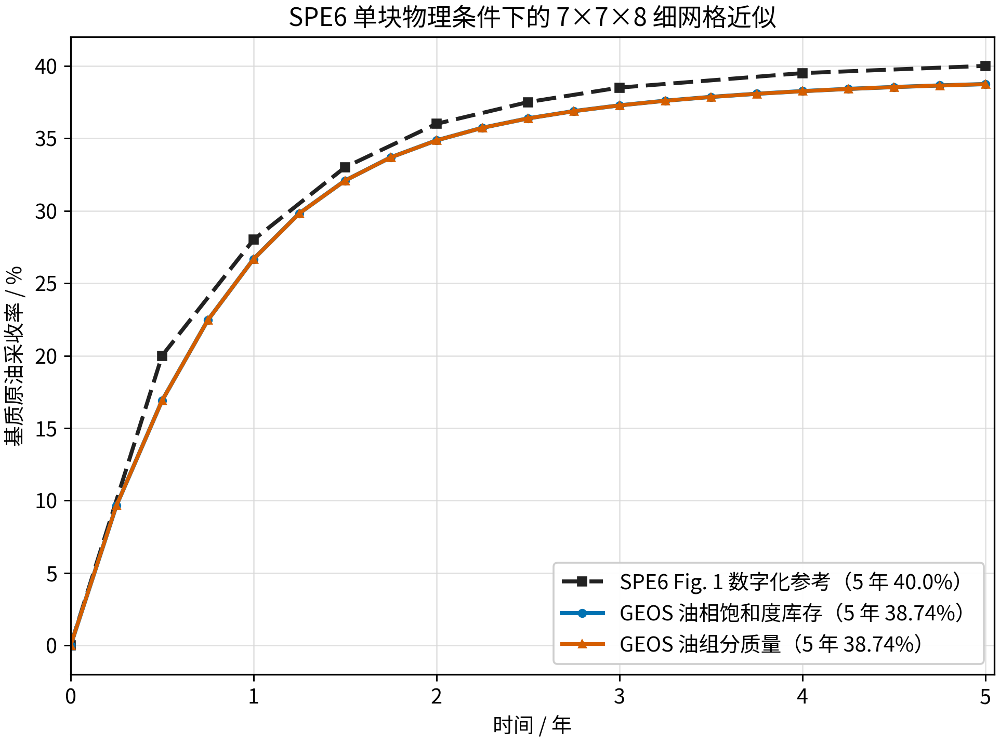
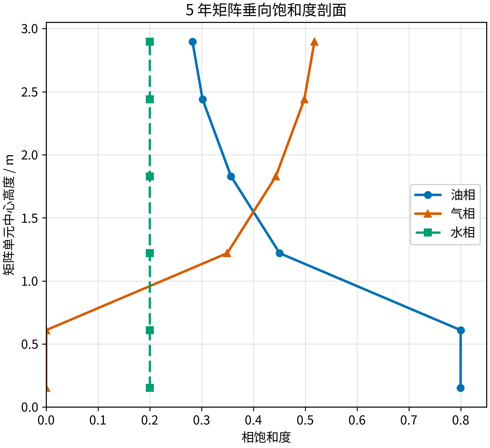

<!-- 目的：报告 SPE6 零裂缝毛管压力细网格重建；关键信息：5 年体积采收率 38.743%，参考值 40.000%。 -->

# SPE6 7x7x8 单重介质细网格重建报告

## 结论

本算例在 SPE6 单块气油重力排驱物理约束下，采用 Thomas 1983 的 `10 ft`、`7x7x8`
细网格和 `0.001 ft` 外层薄壳进行重建。零裂缝气油毛管压力参考曲线在 5 年为
`40.000%`，GEOS 的基质油相体积采收率为 **`38.743%`**，差值为
**`-1.257` 个百分点**；油组分质量采收率为 `38.740%`。

因此，本算例已经达到 **SPE6 公开曲线的工程定量复现**，但不是对原始 Chevron
细网格输入的逐项恢复。SPE6 没有公开其细网格尺寸、外层边界实现和完整统计代码，报告中
必须保留这一限制。



## 验证目的、目标和依据

**验证目的**：检查 GEOS 单重介质细网格黑油模型能否共同组装活油 PVT、气油毛管压力、
三相相对渗透率、重力项和恒定裂缝环境，并重现 SPE6 单块气驱重力排油过程。

**验证目标**：以 SPE6 1990 Fig. 1 中零裂缝毛管压力曲线为外部基准，比较 0--5 年
基质原油采收率；重点比较 5 年约 `40%` 的终值，同时检查整条曲线和垂向相分布。

**为什么能够验证**：模型显式离散基质块内部的垂向流动。气体从固定裂缝薄壳进入基质，
密度较大的油向下排出；最终采收率由 PVT、毛管压力、相对渗透率和重力共同决定。若这些
模块的物理方向或组装错误，采收率曲线及“上部富气、下部富油”的垂向剖面不会同时接近
文献结果。

## 名称和文献边界

本目录是 **单重介质细网格算例**：150 个内部单元表示基质，242 个外层薄单元表示裂缝
环境。它不是一个网格内同时含基质、裂缝两套自由度的“双重介质单块算例”。

- SPE6 1990 提供 `10x10x10 ft`、4500 psig、5 年、零裂缝毛管压力和约 40% 采收率目标。
- Thomas 1983 提供 `7x7x8` 网格、`0.001 ft` 外层薄壳及细网格岩石曲线的实现依据。
- 当前模型应称为“**SPE6 物理约束下的 Thomas 7x7x8 细网格重建**”。

参考文献分别保存在相邻案例目录：

- [`../P0_thomas_single_block/reference/Sixth_SPE_Comparative_DualPorosity_1990.pdf`](../P0_thomas_single_block/reference/Sixth_SPE_Comparative_DualPorosity_1990.pdf)
- [`../fine_grid_thomas_depletion_liveoil/reference/Thomas_1983_Fractured_Reservoir_Simulation.pdf`](../fine_grid_thomas_depletion_liveoil/reference/Thomas_1983_Fractured_Reservoir_Simulation.pdf)

## 物理和数值设置

| 项目 | 当前设置 |
| --- | --- |
| 几何 | `10.002 ft x 10.002 ft x 10.002 ft`，内部基质块为 `10 ft` |
| 网格 | `7x7x8=392` 个单元；150 个基质单元，242 个薄壳单元 |
| 基质孔隙度 | 参考压力 4500 psig 下 `0.29` |
| 薄壳孔隙度 | `1.0` |
| 基质/薄壳渗透率 | `1 md` |
| 温度 | `366 K` |
| 重力 | `9.81 m/s^2`，竖直向下 |
| 基质初态 | `So≈0.80`、`Sw≈0.20`、无主动自由气种子；油为 4500 psig 饱和活油 |
| 裂缝初态和边界 | `Sg≈0.990`、`So≈0.005`、`Sw≈0.005`，压力和总体组分保持不变 |
| 基质气油 Pc | Thomas Table 3 按 4500/5545 psig 界面张力比 `5.2442396313` 缩放 |
| 基质水油 Pc | SPE6 Table 1 |
| 裂缝 Pc | 气油、水油均为零 |
| 裂缝相渗端点 | `Sor,f=Swr,f=0.005`；种子油、水在该点 `kr=0`，不形成无限供油/供水 |
| 压力边界 | 薄壳按气体静水梯度保持以块中心 4500 psig 为基准的压力 |
| 时间 | 5 年；每 0.25 年一个可续算分段；`maxDt=50000 s` |
| 非线性求解 | `newtonTol=1e-3`，`newtonMaxIter=80` |

GEOS 不能直接把相饱和度作为持续约束，因此输入中固定的是薄壳压力和三种总体组分质量
分数。实际代表单元在初始和 5 年时均为：

```text
So = 0.00500026
Sg = 0.98999935
Sw = 0.00500039
```

这证明“固定裂缝饱和度”已经通过等价的压力/总体组分约束实现。

## 采收率定义

基质油相体积库存采收率按孔隙体积加权计算：

$$
R_V(t)=1-\frac{\sum_i \phi_i(t)V_iS_{o,i}(t)}
{\sum_i \phi_i(0)V_iS_{o,i}(0)}.
$$

油组分质量采收率使用 GEOS 重启字段 `compAmount`：

$$
R_M(t)=1-\frac{\sum_i M_{o,i}(t)}{\sum_i M_{o,i}(0)}.
$$

GEOS 源码中 `compAmount` 按 `porosity * elementVolume * componentDensity` 计算，因此它是
单元内的组分总量，不是未乘体积的密度。两种统计在 5 年仅相差 `0.0032` 个百分点，说明
当前定量结论不依赖统计口径。

## 定量结果

| 时间 / 年 | GEOS 体积采收率 / % | GEOS 油组分质量采收率 / % | SPE6 参考 / % | 体积法差值 / pp |
| ---: | ---: | ---: | ---: | ---: |
| 0.25 | 9.641 | 9.640 | 10.000 | -0.359 |
| 0.50 | 16.903 | 16.901 | 20.000 | -3.097 |
| 1.00 | 26.671 | 26.669 | 28.000 | -1.329 |
| 2.00 | 34.858 | 34.856 | 36.000 | -1.142 |
| 3.00 | 37.273 | 37.270 | 38.500 | -1.227 |
| 5.00 | **38.743** | **38.740** | **40.000** | **-1.257** |

整条数字化曲线的最大绝对偏差为 `3.097` 个百分点，发生在 0.5 年；1--5 年偏差稳定在
约 `1.1--1.3` 个百分点。CSV 原始汇总见
[`analysis/recovery_results.csv`](analysis/recovery_results.csv)。

## 物理图像

5 年时，上部基质气相饱和度约 `0.52`，向下逐层降低；下部油相饱和度约 `0.80`，向上
降低到约 `0.28`。这表示低密度气体从裂缝进入块体上部，较高密度油向下排出，符合气油
重力驱替。水相在各层保持约 `0.20`，说明残余水没有被误当作持续渗吸流体。



5 年基质平均水饱和度为 `0.2000204`，相对初始 `0.2000001` 仅变化约 `2.0e-5`。

## 数值稳定性和已排除错误

20 个分段全部完成，共 3168 个接受时间步；时间步切分次数和丢弃非线性迭代次数均为零。
本地总墙钟时间约 11.97 分钟。

早期固定薄壳试验仍使用零残余直线相渗，使 `Sw=0.005` 的无限裂缝储集体持续向基质供水，
5 年采收率达到错误的 `52.067%`，基质平均水饱和度升到 `0.441`。将数值种子定义为
`Swr,f=Sor,f=0.005` 后，伪供水消失，5 年结果降为 `38.743%`。因此，52% 结果已被排除，
不能作为 SPE6 验证数据。

## 复现方法

```bash
python3 generate_case.py
python3 run_segments.py \
  --output /tmp/fine_grid_spe6_7x7x8_fixed_fracture_residual_seed \
  --segments 20
MPLCONFIGDIR=/tmp/mplconfig_fine_grid_spe6 python3 analyze_results.py \
  --output /tmp/fine_grid_spe6_7x7x8_fixed_fracture_residual_seed \
  --segments 20
```

运行日志、VTK 和重启文件只保存在 `/tmp`，不纳入 Git。仓库只保存输入生成器、20 个分段
输入、运行/分析脚本、数字化参考、汇总 CSV、图片和本报告。
